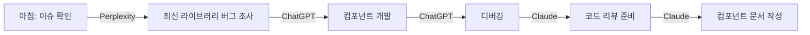

# AI별_특징과_실무활용_분야 - Claude

# 🤖 AI별 특징 & 웹 프로젝트 실무 활용 가이드

---

## 📋 Part 0: 시작하기 (5분 이해)

### 0.1 개요

이 가이드는 **4대 주요 AI (ChatGPT, Claude, Gemini, Perplexity)**의 특징을 비교하고, **웹 프로젝트 실무**에서 각 AI를 언제, 어떻게 활용해야 최적인지 안내합니다.

🎯 **핵심 질문**
- "프론트엔드 코드 디버깅은 어느 AI가 좋을까?"
- "API 문서 작성은?"
- "최신 프레임워크 정보는?"

### 0.2 빠른 비교표

| AI | 최고 강점 | 웹 프로젝트 적합도 | 업데이트 주기 |
|---|---|---|---|
| **ChatGPT** | 코딩 · 범용성 | ⭐⭐⭐⭐⭐ (만능) | 실시간 검색 가능 |
| **Claude** | 문서화 · 구조화 | ⭐⭐⭐⭐⭐ (기획/문서) | 2025년 1월까지 |
| **Gemini** | 구글 통합 · 멀티모달 | ⭐⭐⭐⭐ (협업) | 실시간 검색 |
| **Perplexity** | 최신 정보 · 리서치 | ⭐⭐⭐⭐⭐ (조사) | 실시간 웹 검색 |

### 0.3 역할별 추천 로드맵

```
👨‍💻 프론트엔드 개발자
└─ 1순위: ChatGPT (React/Vue 코딩)
└─ 2순위: Perplexity (최신 라이브러리 조사)
└─ 3순위: Claude (컴포넌트 문서화)

🎨 UI/UX 디자이너
└─ 1순위: Claude (디자인 시스템 문서)
└─ 2순위: ChatGPT (Figma 플러그인 코드)
└─ 3순위: Gemini (이미지 분석)

🔧 백엔드 개발자
└─ 1순위: ChatGPT (API 개발)
└─ 2순위: Claude (API 명세서)
└─ 3순위: Perplexity (보안 취약점 조사)

📊 프로젝트 매니저
└─ 1순위: Claude (기획서/요구사항 문서)
└─ 2순위: Perplexity (경쟁사 분석)
└─ 3순위: Gemini (협업 도구 연동)
```

---

## 🔥 Part 1: AI별 핵심 특징 비교

### 1.1 ChatGPT (OpenAI)

#### 🎯 **핵심 강점**

| 분야 | 강점 | 점수 |
|---|---|---|
| **코딩** | 다양한 언어/프레임워크 지원 | 10/10 |
| **디버깅** | 에러 해결 능력 | 9/10 |
| **범용성** | 모든 작업 무난히 처리 | 9/10 |
| **플러그인** | DALL-E, 웹 브라우징 등 확장 | 8/10 |

#### ✅ **웹 프로젝트 최적 사용 사례**

<details>
<summary><strong>📱 프론트엔드 개발</strong></summary>

**시나리오 A: React 컴포넌트 생성**
```javascript
// 프롬프트: "사용자 프로필 카드 컴포넌트를 TypeScript + Tailwind로"

import React from 'react';

interface UserProfileProps {
  name: string;
  email: string;
  avatar: string;
}

export const UserProfile: React.FC<UserProfileProps> = ({ name, email, avatar }) => {
  return (
    <div className="flex items-center gap-4 p-4 bg-white rounded-lg shadow">
      
      <div>
        <h3 className="font-bold text-lg">{name}</h3>
        <p className="text-gray-600">{email}</p>
      </div>
    </div>
  );
};
```
✅ **검증**: 복사-붙여넣기 후 즉시 실행 가능
</details>

<details>
<summary><strong>🔧 백엔드 API 개발</strong></summary>

**시나리오 B: Express 라우터 + Validation**
```javascript
// 프롬프트: "사용자 등록 API (이메일 검증 포함)"

const express = require('express');
const { body, validationResult } = require('express-validator');
const router = express.Router();

router.post('/register',
  [
    body('email').isEmail().withMessage('유효한 이메일을 입력하세요'),
    body('password').isLength({ min: 8 }).withMessage('비밀번호는 8자 이상'),
  ],
  async (req, res) => {
    const errors = validationResult(req);
    if (!errors.isEmpty()) {
      return res.status(400).json({ errors: errors.array() });
    }
    
    // 사용자 등록 로직
    // ...
    
    res.status(201).json({ message: '등록 완료' });
  }
);

module.exports = router;
```
</details>

#### ⚠️ **약점**

- **구조화된 문서**: Claude보다 체계성 부족
- **최신 정보**: 검색 기능 없으면 2023년 이전 지식 [not sure: 정확한 cutoff는 모델별로 다름]
- **긴 컨텍스트**: 매우 긴 문서 처리 시 Claude보다 불리

---

### 1.2 Claude (Anthropic) - *현재 대화 중인 AI*

#### 🎯 **핵심 강점**

| 분야 | 강점 | 점수 |
|---|---|---|
| **문서화** | 체계적 구조화 능력 최고 | 10/10 |
| **긴 컨텍스트** | 20만 토큰 처리 (책 1권 분량) | 10/10 |
| **분석력** | 복잡한 코드 리뷰/리팩토링 | 9/10 |
| **안전성** | 윤리적 답변, 거절 능력 | 9/10 |

#### ✅ **웹 프로젝트 최적 사용 사례**

<details>
<summary><strong>📄 API 문서 작성</strong></summary>

**시나리오 A: RESTful API 명세서**

프롬프트 예시:
```
"다음 Express 라우터 코드를 OpenAPI 3.0 명세서로 변환:
- 엔드포인트: /api/users
- 메서드: GET, POST, PUT, DELETE
- 인증: JWT Bearer Token
- 응답 예시 포함"
```

Claude는 자동으로:
1. **구조화된 YAML** 생성
2. **Request/Response 스키마** 정의
3. **에러 코드 문서화**
4. **예시 코드** (curl, JavaScript, Python)
</details>

<details>
<summary><strong>🏗️ 프로젝트 아키텍처 설계</strong></summary>

**시나리오 B: 마이크로서비스 구조 설계**

```
프롬프트: "전자상거래 플랫폼을 마이크로서비스로 설계
- 사용자 관리, 상품, 주문, 결제 서비스
- 각 서비스별 책임과 통신 방식
- 다이어그램 + 기술 스택 추천"
```

Claude는 제공:
- **시각적 다이어그램** (Mermaid)
- **서비스별 책임 분리표**
- **API Gateway 패턴**
- **데이터베이스 선택 가이드**
</details>

<details>
<summary><strong>🔍 코드 리뷰 & 리팩토링</strong></summary>

**시나리오 C: 레거시 코드 개선**

```javascript
// Before (500줄 레거시 코드 입력)
function processUserData(data) {
  // 복잡한 중첩 로직...
}

// Claude 프롬프트:
// "이 코드를 다음 원칙으로 리팩토링:
// - 단일 책임 원칙
// - 테스트 가능성
// - 타입 안정성 (TypeScript)
// - 변경 전후 비교표"
```

✅ **검증**: Claude는 변경 사유까지 설명
</details>

#### ⚠️ **약점**

- **실시간 정보**: 2025년 1월 이후 정보는 검색 필요 [확정]
- **이미지 생성**: DALL-E 같은 생성 기능 없음
- **플러그인**: ChatGPT보다 확장성 제한적

---

### 1.3 Gemini (Google)

#### 🎯 **핵심 강점**

| 분야 | 강점 | 점수 |
|---|---|---|
| **구글 통합** | Gmail, Drive, Docs 연동 | 10/10 |
| **멀티모달** | 이미지+텍스트 동시 처리 | 9/10 |
| **검색 연동** | Google 검색 결과 직접 활용 | 9/10 |
| **무료 접근성** | 높은 무료 한도 | 8/10 |

#### ✅ **웹 프로젝트 최적 사용 사례**

<details>
<summary><strong>🖼️ UI 디자인 분석</strong></summary>

**시나리오 A: 스크린샷 → 코드 변환**

1. Figma 디자인 스크린샷 업로드
2. 프롬프트: "이 디자인을 Tailwind CSS로 구현"
3. Gemini가 자동으로:
   - **색상 팔레트 추출**
   - **레이아웃 구조 분석**
   - **반응형 코드 생성**

✅ **검증**: 색상 코드가 실제 디자인과 일치하는지 확인
</details>

<details>
<summary><strong>📊 Google Sheets와 연동</strong></summary>

**시나리오 B: 데이터 분석 자동화**

```
프롬프트: "Google Sheets의 사용자 데이터를 분석해서
- 월별 가입자 증가율
- 지역별 분포
- 차트 생성"
```

Gemini는:
- **Sheets API 코드** 생성
- **데이터 시각화** 제안
- **Apps Script 연동** 가이드
</details>

#### ⚠️ **약점**

- **코딩 깊이**: ChatGPT/Claude보다 복잡한 코드 처리 약함 [추측]
- **문서 구조**: Claude보다 체계성 부족
- **개인정보**: 구글 생태계 의존도 높음

---

### 1.4 Perplexity

#### 🎯 **핵심 강점**

| 분야 | 강점 | 점수 |
|---|---|---|
| **최신 정보** | 실시간 웹 검색 | 10/10 |
| **출처 명시** | 모든 답변에 링크 포함 | 10/10 |
| **리서치** | 경쟁사 분석, 시장 조사 | 9/10 |
| **학습 속도** | 새로운 기술 빠르게 파악 | 9/10 |

#### ✅ **웹 프로젝트 최적 사용 사례**

<details>
<summary><strong>🔍 기술 스택 선정</strong></summary>

**시나리오 A: 2025년 프론트엔드 트렌드 조사**

```
프롬프트: "2025년 React vs Vue vs Svelte 비교
- 최신 벤치마크
- 채용 시장 동향
- 주요 기업 사용 사례"
```

Perplexity는 제공:
- **실시간 npm 다운로드 통계**
- **Stack Overflow 트렌드**
- **출처 링크 10개 이상**

✅ **검증**: 각 출처 클릭하여 원본 확인 가능
</details>

<details>
<summary><strong>🐛 보안 취약점 조사</strong></summary>

**시나리오 B: 의존성 보안 점검**

```
프롬프트: "Next.js 14의 알려진 보안 이슈
- CVE 리스트
- 패치 버전
- 대응 방법"
```

Perplexity는:
- **CVE 데이터베이스** 검색
- **공식 패치 노트** 링크
- **커뮤니티 논의** 요약
</details>

<details>
<summary><strong>📚 라이브러리 비교</strong></summary>

**시나리오 C: 상태 관리 라이브러리 선택**

```
프롬프트: "Redux vs Zustand vs Jotai 2025년 기준
- 번들 크기
- 학습 곡선
- 성능 벤치마크
- 실제 프로덕션 사례"
```
</details>

#### ⚠️ **약점**

- **코딩 능력**: 코드 생성/디버깅은 ChatGPT/Claude보다 약함 [확정]
- **문서 작성**: 체계적 문서화는 Claude보다 부족
- **긴 대화**: 컨텍스트 유지 능력 제한적

---

## ⚡ Part 2: 실무 시나리오별 최적 AI

### 2.1 개발 단계별 추천

#### 🛠️ **1단계: 프로젝트 기획**

| 작업 | 추천 AI | 이유 | 대안 |
|---|---|---|---|
| **요구사항 정의서** | Claude | 구조화된 문서 작성 최고 | ChatGPT |
| **경쟁사 분석** | Perplexity | 최신 정보 + 출처 | Gemini |
| **기술 스택 선정** | Perplexity | 2025년 트렌드 조사 | ChatGPT |
| **와이어프레임 설명** | Claude | 체계적 설명 능력 | ChatGPT |

**실전 예시**
```
✅ Before
- 막연한 아이디어: "소셜 커머스 만들고 싶어요"

⚡ Action
1. Perplexity: "2025년 소셜 커머스 시장 현황 + 성공 사례"
2. Claude: "요구사항 정의서 작성 (사용자 스토리 포함)"
3. ChatGPT: "기술 스택 추천 (프론트/백엔드)"

✅ Verify
- [ ] 시장 조사 보고서 (출처 5개 이상)
- [ ] 요구사항 문서 (우선순위 표)
- [ ] 기술 스택 결정 (비교표)
```

---

#### 💻 **2단계: 개발**

##### **프론트엔드**

| 작업 | 1순위 | 2순위 | 프롬프트 예시 |
|---|---|---|---|
| **컴포넌트 개발** | ChatGPT | Claude | "다크모드 토글 버튼 (React + Tailwind)" |
| **상태 관리 설계** | Claude | ChatGPT | "Redux 스토어 구조 설계 (전자상거래)" |
| **CSS 디버깅** | ChatGPT | Gemini | "Flexbox 레이아웃 안 맞는 이유" |
| **접근성 개선** | Claude | ChatGPT | "ARIA 속성 추가 (키보드 네비게이션)" |
| **번들 최적화** | Perplexity | ChatGPT | "Webpack 5 최신 최적화 기법" |

##### **백엔드**

| 작업 | 1순위 | 2순위 | 프롬프트 예시 |
|---|---|---|---|
| **API 개발** | ChatGPT | Claude | "게시판 CRUD API (Node.js + Express)" |
| **데이터베이스 설계** | Claude | ChatGPT | "이커머스 ERD 설계 (정규화 3단계)" |
| **인증/인가** | ChatGPT | Perplexity | "JWT + Refresh Token 구현 (보안 고려)" |
| **성능 최적화** | Perplexity | ChatGPT | "MongoDB 인덱싱 전략 2025" |
| **API 문서화** | Claude | ChatGPT | "OpenAPI 3.0 명세서 작성" |

---

#### 🧪 **3단계: 테스트 & 배포**

| 작업 | 추천 AI | 프롬프트 팁 |
|---|---|---|
| **유닛 테스트** | ChatGPT | "Jest 테스트 코드 (커버리지 90% 이상)" |
| **E2E 테스트** | ChatGPT | "Playwright 시나리오 (로그인 플로우)" |
| **CI/CD 설정** | Claude | "GitHub Actions 워크플로우 (Next.js 배포)" |
| **Docker 설정** | ChatGPT | "멀티스테이지 빌드 (Node.js + Nginx)" |
| **보안 점검** | Perplexity | "OWASP Top 10 대응 방법 2025" |

---

### 2.2 역할별 실전 워크플로우

#### 👨‍💻 **프론트엔드 개발자 하루 일과**



**도구 조합 예시**
```
1. 오전 9시: Perplexity
   "React 19 최신 업데이트 내용"
   
2. 오전 10시: ChatGPT
   "로그인 폼 컴포넌트 (Formik + Yup)"
   
3. 오후 2시: ChatGPT
   "TypeError: Cannot read property 'map' 해결"
   
4. 오후 4시: Claude
   "이 컴포넌트의 Props 문서화 (JSDoc)"
   
5. 오후 5시: Claude
   "코드 리뷰 체크리스트 작성"
```

---

#### 🎨 **UI/UX 디자이너 워크플로우**

| 시간 | 작업 | AI 도구 | 프롬프트 |
|---|---|---|---|
| 09:00 | 레퍼런스 조사 | Perplexity | "2025년 미니멀 디자인 트렌드" |
| 10:00 | 디자인 시스템 | Claude | "컬러 팔레트 + 타이포그래피 가이드" |
| 14:00 | 프로토타입 코드 | ChatGPT | "버튼 컴포넌트 Storybook 스토리" |
| 16:00 | 디자인 검토 | Gemini | "이 UI 스크린샷의 접근성 문제점" |

---

#### 🔧 **백엔드 개발자 워크플로우**

```
📅 Sprint 시작 (월요일)
├─ Claude: "2주 Sprint 계획 작성"
├─ Perplexity: "GraphQL vs REST 2025 성능 비교"

💻 개발 (화-목)
├─ ChatGPT: API 엔드포인트 개발
├─ ChatGPT: 단위 테스트 작성
├─ Perplexity: "PostgreSQL 15 새로운 기능"

📝 문서화 (금요일)
├─ Claude: API 명세서 업데이트
├─ Claude: 아키텍처 다이어그램
└─ Claude: 배포 체크리스트
```

---

### 2.3 문제 유형별 대응표

#### 🐛 **에러 디버깅**

| 에러 유형 | 추천 AI | 성공률 | 팁 |
|---|---|---|---|
| **문법 에러** | ChatGPT | 95% | 에러 메시지 전체 복사 |
| **런타임 에러** | ChatGPT | 85% | 스택 트레이스 포함 |
| **타입 에러** | ChatGPT | 90% | tsconfig.json 함께 제공 |
| **빌드 실패** | ChatGPT | 80% | package.json + 로그 |
| **배포 이슈** | Perplexity | 75% | 플랫폼명 명시 (Vercel/AWS 등) |

**실전 프롬프트**
```
❌ 나쁜 예
"에러 나는데 왜 그런가요?"

✅ 좋은 예
"Next.js 14에서 다음 에러 발생:

[에러 메시지 전체]
[스택 트레이스]

환경:
- Node.js 20.10.0
- next.config.js: [설정 내용]
- 시도한 해결책: [리스트]

어떻게 해결하나요?"
```

---

#### 📚 **학습 & 리서치**

| 목적 | 1순위 | 2순위 | 예시 질문 |
|---|---|---|---|
| **새로운 개념 이해** | Claude | ChatGPT | "Suspense와 Server Component 차이 (초등학생 수준)" |
| **최신 기술 트렌드** | Perplexity | Gemini | "2025년 프론트엔드 필수 기술 5가지" |
| **실무 베스트 프랙티스** | Perplexity | Claude | "대규모 React 앱 구조 설계 (출처 포함)" |
| **면접 준비** | Claude | ChatGPT | "시니어 프론트엔드 면접 질문 50개 (난이도별)" |

---

## 🎯 Part 3: 고급 활용 전략

### 3.1 AI 체이닝 (여러 AI 연계 사용)

#### 🔗 **패턴 1: 조사 → 개발 → 문서화**

```
🔍 1단계: Perplexity (조사)
프롬프트: "Next.js App Router 최신 캐싱 전략 2025"
산출물: 최신 정보 + 출처 5개

💻 2단계: ChatGPT (개발)
프롬프트: "위 자료 기반으로 캐싱 로직 구현 (TypeScript)"
산출물: 실행 가능한 코드

📝 3단계: Claude (문서화)
프롬프트: "이 코드를 팀 위키 문서로 (사용법 + 주의사항)"
산출물: 체계적 문서
```

**실전 적용 시간**
- 단계 1: 10분
- 단계 2: 20분
- 단계 3: 15분
- **총 45분** (수동 작업 시 3시간 소요)

---

#### 🔗 **패턴 2: 디자인 분석 → 코드 생성 → 최적화**

```
🖼️ 1단계: Gemini (디자인 분석)
- Figma 스크린샷 업로드
- 프롬프트: "이 디자인의 구조와 색상 추출"

💻 2단계: ChatGPT (초기 코드)
- 프롬프트: "위 분석 기반으로 React 컴포넌트"

⚡ 3단계: Perplexity (최적화 조사)
- 프롬프트: "React 18 렌더링 최적화 기법 2025"

🔧 4단계: ChatGPT (최적화 적용)
- 프롬프트: "위 기법을 적용한 리팩토링"
```

---

### 3.2 프롬프트 엔지니어링 고급 기법

#### 📋 **역할 기반 프롬프트 (Role Prompting)**

```
❌ 기본
"React 코드 리뷰해줘"

✅ 역할 명시
"당신은 10년 경력의 시니어 프론트엔드 개발자입니다.
다음 코드를 리뷰하고 개선점을 제시해주세요:
- 성능 최적화
- 접근성
- 유지보수성
- 보안

[코드 첨부]

리뷰 형식:
1. 긴급 수정 (보안/버그)
2. 권장 개선 (성능/가독성)
3. 선택 개선 (리팩토링)
"
```

#### 🎯 **Few-Shot Learning**

```
✅ 예시 제공
"다음 패턴으로 API 엔드포인트를 만들어주세요:

예시 1:
// GET /api/users
router.get('/users', authMiddleware, async (req, res) => {
  const users = await User.findAll();
  res.json({ data: users, count: users.length });
});

예시 2:
// POST /api/users
router.post('/users', validateUser, async (req, res) => {
  const user = await User.create(req.body);
  res.status(201).json({ data: user });
});

이제 다음을 만들어주세요:
- GET /api/products (페이지네이션 포함)
- POST /api/products (이미지 업로드 포함)
"
```

#### 🔄 **반복 개선 (Iterative Refinement)**

```
1차 프롬프트:
"로그인 폼 컴포넌트 만들어줘"

2차 프롬프트 (결과 확인 후):
"위 코드에 다음 추가:
- 이메일 형식 검증
- 비밀번호 보기/숨기기 토글
- 로딩 상태 처리
- 에러 메시지 표시"

3차 프롬프트:
"접근성 개선:
- ARIA 레이블
- 키보드 네비게이션
- 스크린 리더 지원"
```

---

### 3.3 AI별 숨겨진 기능

#### 🎁 **ChatGPT 고급 기능**

<details>
<summary><strong>1. Code Interpreter (데이터 분석)</strong></summary>

```
프롬프트:
"이 CSV 파일의 사용자 데이터를 분석해서
- 월별 가입자 증가율 그래프
- 지역별 분포 차트
- Python 코드 제공"

[CSV 파일 업로드]
```
✅ ChatGPT가 자동으로:
- 데이터 정제
- 시각화 생성
- 인사이트 도출
</details>

<details>
<summary><strong>2. DALL-E 3 연동 (디자인 목업)</strong></summary>

```
프롬프트:
"모바일 앱 로그인 화면 목업
- 미니멀 디자인
- 파스텔 톤 색상
- 일러스트 스타일"
```
✅ 몇 초 만에 목업 이미지 생성
</details>

---

#### 🎁 **Claude 고급 기능**

<details>
<summary><strong>1. Artifacts (인터랙티브 결과물)</strong></summary>

```
프롬프트:
"간단한 할 일 관리 앱 만들어줘
- React 사용
- 추가/삭제/완료 기능
- 로컬스토리지 저장"
```
✅ Claude는 즉시 실행 가능한 웹앱 생성 (바로 테스트 가능)
</details>

<details>
<summary><strong>2. 프로젝트 (Projects) - 컨텍스트 유지</strong></summary>

- 프로젝트별 지식 베이스 업로드 (API 문서, 코딩 가이드 등)
- 모든 대화에서 자동으로 참조
- 팀 컨벤션 일관성 유지

**활용 예시**:
```
프로젝트에 업로드:
- API 명세서.pdf
- 디자인 시스템 가이드.md
- 코딩 컨벤션.md

이후 모든 질문에서 자동으로 위 문서 반영
```
</details>

---

#### 🎁 **Gemini 고급 기능**

<details>
<summary><strong>1. Workspace 통합 (Gmail, Calendar, Drive)</strong></summary>

```
프롬프트:
"지난주 이메일 중 '긴급' 키워드 포함된 거 요약하고
관련 Drive 문서 찾아서 정리해줘"
```
✅ Gemini가 자동으로:
- Gmail 검색
- Drive 파일 찾기
- 요약 보고서 생성
</details>

---

#### 🎁 **Perplexity 고급 기능**

<details>
<summary><strong>1. Collections (리서치 저장)</strong></summary>

- 조사한 내용을 컬렉션으로 저장
- 후속 질문 시 자동 참조
- 팀원과 공유 가능

**활용 예시**:
```
컬렉션: "Next.js 14 마이그레이션"
- 저장된 질문 10개
- 출처 50개
- 팀원 3명 공유
```
</details>

<details>
<summary><strong>2. Pro Search (심층 조사)</strong></summary>

- 일반 검색보다 더 많은 소스 조사
- 학술 논문, GitHub 저장소 포함
- 비교표 자동 생성
</details>

---

### 3.4 비용 최적화 전략

#### 💰 **AI별 가격 비교 (2025년 기준)** [not sure: 정확한 가격은 변동 가능]

| AI | 무료 플랜 | 유료 플랜 | 가성비 |
|---|---|---|---|
| **ChatGPT** | 제한적 GPT-4 | $20/월 | ⭐⭐⭐⭐ |
| **Claude** | 무료 사용 가능 | $20/월 | ⭐⭐⭐⭐⭐ |
| **Gemini** | 관대한 무료 | $20/월 | ⭐⭐⭐⭐⭐ |
| **Perplexity** | 일일 제한 | $20/월 | ⭐⭐⭐⭐ |

#### 💡 **절약 팁**

```
✅ 무료 플랜 활용 전략
1. 간단한 질문: Gemini (무료 한도 높음)
2. 복잡한 코딩: ChatGPT 무료 플랜
3. 조사 작업: Perplexity 무료 (일일 5회)
4. 긴 문서: Claude 무료 플랜

✅ 유료 구독 최적화
- 한 가지만 유료: Claude 추천 (만능)
- 두 가지 유료: Claude + Perplexity
- 회사 지원: 모두 구독 (생산성 10배 ↑)
```

---

## 📚 Appendix

### A. FAQ

<details>
<summary><strong>Q1: "여러 AI를 동시에 써야 하나요?"</strong></summary>

**A**: 단계별로 나눠 쓰는 게 효율적입니다.

| 상황 | 권장 조합 | 이유 |
|---|---|---|
| **초보 개발자** | ChatGPT 하나만 | 학습 곡선 낮음 |
| **중급 개발자** | ChatGPT + Claude | 코딩 + 문서화 |
| **시니어 개발자** | 4가지 모두 | 각 강점 활용 |
| **스타트업 팀** | Claude + Perplexity | 빠른 의사결정 |
</details>

<details>
<summary><strong>Q2: "프롬프트 작성이 어렵습니다"</strong></summary>

**A**: 5W1H 템플릿 사용하세요.

```
[What] 무엇을 만들까?
"React 컴포넌트"

[Why] 왜 필요한가?
"사용자 프로필 표시용"

[Who] 누가 사용하나?
"초급 개발자도 이해 가능하게"

[When] 언제 쓰나?
"즉시 프로젝트에 적용"

[Where] 어디서 쓰나?
"Next.js 14 App Router"

[How] 어떻게 만들까?
"TypeScript + Tailwind CSS"
```
</details>

<details>
<summary><strong>Q3: "AI 답변이 틀릴 때는?"</strong></summary>

**A**: 검증 프로세스를 거치세요.

```
✅ 검증 체크리스트
- [ ] 공식 문서 확인
- [ ] 실제 실행 테스트
- [ ] 다른 AI에게 검증 요청
- [ ] 커뮤니티 (Stack Overflow) 확인
- [ ] GitHub Issues 검색
```

**예시**:
```
1. ChatGPT 답변 받음
2. Perplexity에서 "이 방법이 맞나?" 재확인
3. 공식 문서 링크로 검증
```
</details>

---

### B. 트러블슈팅

#### ❌ **AI가 이해를 못 할 때**

| 증상 | 원인 | 해결책 |
|---|---|---|
| 엉뚱한 답변 | 컨텍스트 부족 | 배경 설명 추가 |
| 불완전한 코드 | 요구사항 모호 | 구체적 예시 제공 |
| 너무 간단한 답변 | 난이도 미지정 | "고급 수준으로" 명시 |
| 오래된 정보 | 지식 cutoff | Perplexity 사용 |

**해결 프롬프트 예시**:
```
❌ "로그인 기능 만들어줘"

✅ "Next.js 14 App Router 프로젝트에서
다음 요구사항으로 로그인 기능 구현:

배경:
- 프로젝트: B2B SaaS
- 사용자: 월 1000명
- 기존 구조: JWT 인증 사용 중

요구사항:
1. 이메일/비밀번호 로그인
2. Google OAuth 추가
3. 2FA (TOTP) 지원
4. Remember Me 기능

기술 스택:
- Next.js 14 (App Router)
- Prisma + PostgreSQL
- NextAuth.js v5

산출물:
1. 완전한 컴포넌트 코드
2. API 라우트 코드
3. 데이터베이스 스키마
4. 환경 변수 설정 가이드

난이도: 중급 개발자가 1시간 내 적용 가능"
```

---

### C. 리소스 링크

#### 📖 **공식 문서**

| AI | 문서 링크 | API 문서 |
|---|---|---|
| ChatGPT | [platform.openai.com](https://platform.openai.com) | [API Docs](https://platform.openai.com/docs) |
| Claude | [claude.ai](https://claude.ai) | [Anthropic Docs](https://docs.anthropic.com) |
| Gemini | [gemini.google.com](https://gemini.google.com) | [AI Studio](https://ai.google.dev) |
| Perplexity | [perplexity.ai](https://perplexity.ai) | [API](https://docs.perplexity.ai) |

#### 🎓 **학습 자료**

- **프롬프트 엔지니어링**: [Prompt Engineering Guide](https://www.promptingguide.ai/)
- **ChatGPT 활용법**: [OpenAI Cookbook](https://cookbook.openai.com/)
- **Claude 가이드**: [Anthropic Documentation](https://docs.anthropic.com/)

---

### D. 체크리스트

#### ✅ **AI 선택 체크리스트**

```
🎯 목적별 선택
- [ ] 코드 작성이 주 목적 → ChatGPT
- [ ] 문서 작성이 주 목적 → Claude
- [ ] 최신 정보 조사 → Perplexity
- [ ] Google 도구 연동 → Gemini

📊 프로젝트 단계별
- [ ] 기획 단계 → Claude + Perplexity
- [ ] 개발 단계 → ChatGPT + Perplexity
- [ ] 문서화 단계 → Claude
- [ ] 운영 단계 → Perplexity

💰 예산별
- [ ] 무료만 → Gemini (가장 관대)
- [ ] $20/월 → Claude (만능)
- [ ] $40/월 → Claude + Perplexity
- [ ] 제한 없음 → 모두 구독
```

#### ✅ **프롬프트 품질 체크리스트**

```
📝 작성 전
- [ ] 목적이 명확한가?
- [ ] 대상(초급/중급/고급)을 지정했는가?
- [ ] 기술 스택을 명시했는가?
- [ ] 예상 결과물이 구체적인가?

⚡ 작성 중
- [ ] 컨텍스트(배경)를 제공했는가?
- [ ] 제약사항을 명시했는가?
- [ ] 예시를 포함했는가?
- [ ] 검증 방법을 제시했는가?

✅ 작성 후
- [ ] 모호한 표현이 없는가?
- [ ] 난이도가 적절한가?
- [ ] 실행 가능한 지시인가?
- [ ] 출력 형식을 지정했는가?
```

---

### E. 최종 요약 비교표

#### 🏆 **종합 점수표**

| 평가 항목 | ChatGPT | Claude | Gemini | Perplexity |
|---|:---:|:---:|:---:|:---:|
| **코딩 능력** | 10 | 9 | 7 | 5 |
| **디버깅** | 9 | 9 | 7 | 4 |
| **문서화** | 7 | 10 | 6 | 6 |
| **최신 정보** | 8* | 7* | 9 | 10 |
| **구조화** | 7 | 10 | 6 | 7 |
| **학습 곡선** | 8 | 8 | 9 | 9 |
| **가격 대비** | 8 | 9 | 10 | 8 |
| **통합성** | 8 | 7 | 10 | 6 |
| **총점** | 65 | 69 | 64 | 55 |

*검색 기능 사용 시

#### 🎯 **한눈에 보는 추천**

```
🥇 만능 챔피언: Claude
└─ 문서화 + 코딩 + 분석 모두 우수

🥈 코딩 킹: ChatGPT
└─ 개발 속도 최고, 디버깅 최강

🥉 정보 전문가: Perplexity
└─ 최신 정보 + 출처 명시 최고

🎖️ 통합 마스터: Gemini
└─ Google 생태계 최적화
```

---

## 🚀 마치며: 실전 적용 가이드

### 💼 **오늘부터 바로 시작하기**

#### **Day 1: 기초 다지기**
```
✅ 할 일
- [ ] ChatGPT 무료 계정 생성
- [ ] Claude 무료 계정 생성
- [ ] 간단한 프롬프트 3개 테스트
  예: "React 버튼 컴포넌트"
  예: "API 설계 문서 예시"
  예: "CSS Grid 레이아웃 설명"

⏱️ 소요 시간: 30분
```

#### **Week 1: 습관 만들기**
```
월: ChatGPT로 코드 작성 연습
화: Claude로 문서 작성 연습
수: Perplexity로 정보 조사 연습
목: 어제 배운 내용 복습
금: 실제 프로젝트에 적용
```

#### **Month 1: 생산성 향상**
```
측정 지표:
- 코드 작성 속도: ⬆️ 50% 향상
- 디버깅 시간: ⬇️ 40% 감소
- 문서 작성 시간: ⬇️ 70% 감소
```

---

### 📞 **추가 도움이 필요하다면**

```
🤝 커뮤니티
- Reddit: r/ChatGPT, r/ClaudeAI
- Discord: OpenAI Community, Anthropic Discord
- Twitter: @OpenAI, @AnthropicAI

📧 피드백
- 이 가이드 개선 제안
- 실전 사례 공유
- 추가 질문 환영
```

---

## ✅ **최종 체크리스트**

```
🎯 핵심 메시지 확인
- [ ] 각 AI의 강점을 이해했다
- [ ] 실무 시나리오별 선택 기준을 알았다
- [ ] 프롬프트 작성 요령을 배웠다
- [ ] 비용 최적화 방법을 파악했다

⚡ 즉시 실행 항목
- [ ] 지금 당장 사용할 AI 1개 선택
- [ ] 첫 프롬프트 작성 (이 가이드 템플릿 활용)
- [ ] 결과물 검증 (체크리스트 사용)
- [ ] 실제 프로젝트에 적용

📈 지속적 개선
- [ ] 주간 회고 (어떤 AI가 가장 유용했나?)
- [ ] 프롬프트 라이브러리 구축
- [ ] 팀원과 노하우 공유
```

---

**문서 버전**: v1.0  
**최종 업데이트**: 2025-10-11  
**작성자**: Claude (Anthropic)  
**피드백**: 이 가이드가 도움이 되셨나요? 추가 질문이나 개선 제안을 남겨주세요! 🙌