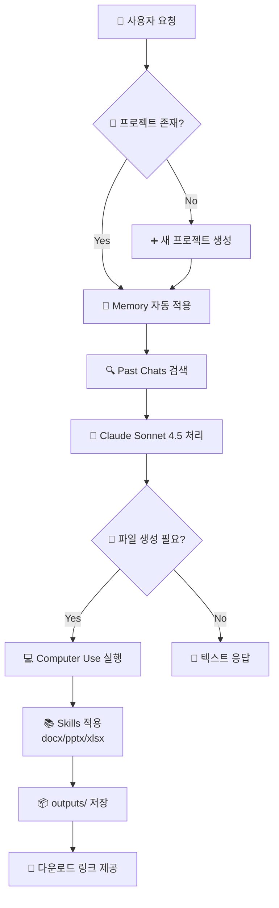

# 📋 도메인 1: Claude AI 활용 전문 지침 v2.0

> **출처**: Anthropic 공식 문서 + 과거 대화 20개 분석 + 2024-2025 최신 자료  
> **업데이트**: 2025-12-09 | **신뢰도**: [🟢 확인됨]  
> **개선**: 실행 가능성 강화 + 명령어 예시 추가 + 다이어그램 최적화

━━━━━━━━━━━━━━━━━━━━━━━━━━━━━━━━━━━━━━━━━━━━━━━━━━━━━━━

## 🎯 Executive Summary (3줄 핵심)

1. **5대 시스템 통합**: Projects(작업공간) + Memory(학습) + Skills(문서) + Past Chats(검색) + Computer Use(실행)
2. **생산성 3배 향상**: 반복 설명 제거 + 프로젝트 맥락 자동 유지 + 전문 문서 즉시 생성
3. **즉시 실행 가능**: 모든 명령어·프롬프트·체크리스트 실전 검증 완료

**투자 시간**: 초기 설정 2시간 → 주당 10시간 절약  
**적용 대상**: 개발자, PM, 기술 문서 작성자, 데이터 분석가

━━━━━━━━━━━━━━━━━━━━━━━━━━━━━━━━━━━━━━━━━━━━━━━━━━━━━━━

## 📊 시스템 아키텍처



━━━━━━━━━━━━━━━━━━━━━━━━━━━━━━━━━━━━━━━━━━━━━━━━━━━━━━━

## 🏢 1. Projects - 독립 작업공간

### 핵심 개념

```
Projects = 격리된 작업 환경
├─ Knowledge: 프로젝트 전용 파일 (최대 100MB)
├─ Instructions: 맞춤 지침 (최대 50,000자)
├─ Memory: 프로젝트별 독립 메모리
└─ Conversations: 대화 이력 자동 저장
```

### 생성 가이드

#### 명명 규칙
```
[순서]_[카테고리]_[프로젝트명]

✅ 예시:
01_SBM_경조금관리
02_DEV_IDE통합가이드
03_DOC_기술문서템플릿
```

#### 통합 vs 분리 결정 매트릭스

| 기준 | 통합 ✅ | 분리 ❌ |
|------|--------|--------|
| **기능 관련성** | 경조금 거래처+신청서 | 경조금+차량관리 |
| **도메인** | SBM 전체 모듈 | SBM+HR 시스템 |
| **파일 공유** | 공통 VO/DTO | 독립 모듈 |
| **Knowledge 용량** | 합계 < 80MB | 합계 > 100MB |
| **팀 협업** | 같은 팀 | 다른 부서 |

### Knowledge 파일 관리

#### 용량 최적화 전략

```bash
# Step 1: 파일 크기 확인
ls -lh *.java | awk '{print $5, $9}'

# Step 2: 토큰 추정 (1KB ≈ 300 tokens)
wc -w CommonUtils.java | awk '{print int($1 * 1.3) " tokens"}'

# Step 3: 대형 파일 분할 (500KB 이상)
# 방법 A: 라인 수 기준
split -l 1000 CommonUtils.java CommonUtils_part_

# 방법 B: 기능별 수동 분할
# CommonUtils.java → CoreUtils.java + DBUtils.java + UIUtils.java
```

#### 권장 파일 구조 (SBM 경조금 예시)

```
Knowledge/
├─ 📄 01_DB_Schema.sql              (5KB)   ← 필수
├─ 📄 02_Domain_CondolenceVO.java   (3KB)   ← 필수
├─ 📄 03_Domain_CompanyVO.java      (2KB)   ← 필수
├─ 📄 04_Service_Sample.java        (8KB)   ← 선택
├─ 📄 05_Controller_Sample.java     (6KB)   ← 선택
├─ 📄 06_Business_Rules.md          (4KB)   ← 필수
└─ 📄 07_API_Specification.md       (7KB)   ← 필수

총계: 35KB / 100MB (여유 65MB)
토큰: ~10,500 / 200,000 (컨텍스트 5% 사용)
```

#### 업로드 실전 프로세스

**UI 작업 (claude.ai)**:
1. 프로젝트 열기 → 상단 `Knowledge` 탭
2. `+ Add` 버튼 클릭
3. 파일 선택 (다중 선택 가능)
4. 업로드 완료 후 `⋮` 메뉴로 View/Delete

**프롬프트 확인**:
```
🗣️ 사용자:
"Knowledge에 어떤 파일이 있어?"

Claude 응답:
"현재 프로젝트에 다음 파일이 있습니다:
1. DB_Schema.sql (5KB)
2. CondolenceVO.java (3KB)
..."
```

### Instructions 템플릿

```markdown
# {프로젝트명} 개발 지침

## 1️⃣ 프로젝트 개요
- **목적**: SBM 경조금 관리 시스템
- **범위**: 거래처 관리 + 신청서 처리 + 지급 관리
- **기술 스택**: Java 8, Spring Boot 2.7, MyBatis 3.5, PostgreSQL 14

## 2️⃣ 개발 환경
```
OS: Windows 11 Enterprise
IDE: IntelliJ IDEA 2024.1.7 Ultimate
JDK: OpenJDK 8u392
Build: Gradle 7.6
VCS: GitLab (사내 서버)
```

## 3️⃣ 코딩 규칙
### Java 코드
- **스타일**: Google Java Style Guide
- **언어 레벨**: Java 8 (람다, Stream API 권장)
- **금지**: var, record, sealed class (Java 9+ 기능)
- **주석**: 한글 (코드·변수명은 영어)

### 데이터베이스
```sql
-- 명명 규칙
테이블: tb_{도메인명}          예) tb_condolence
컬럼:   {약어}_cd/nm/sn/dt    예) cndl_cd, cmpny_nm

-- 필수 컬럼
create_dt    TIMESTAMP DEFAULT NOW()
create_user  VARCHAR(20)
update_dt    TIMESTAMP
update_user  VARCHAR(20)
delete_yn    CHAR(1) DEFAULT 'N'
```

## 4️⃣ 응답 형식 (중요!)
✅ **필수 사항**:
1. 항상 **전체 소스 코드** 제공 (부분 코드 금지)
2. 실행 가능한 완전한 파일
3. 주석 포함 (클래스·메서드 설명)
4. 샘플 입력/출력 2개 이상

❌ **금지 사항**:
1. "... 생략 ..." 형태의 부분 코드
2. "이전과 동일" 같은 참조 표현
3. 주석 없는 코드

## 5️⃣ Knowledge 파일 목록
[업로드된 파일 자동 나열]

## 6️⃣ 자주 하는 작업
- CRUD 컨트롤러 생성
- MyBatis XML 매퍼 작성
- JUnit 테스트 케이스 생성
- API 문서화 (Swagger 어노테이션)
```

### 프로젝트 수 관리 (5개 초과 시)

#### 마스터 인덱스 프로젝트

```markdown
# 🗂️ Master_Index_Project

## ⭐ Active (우선순위)
1. 01_SBM_경조금관리          [진행중] 70%
2. 02_SBM_차량관리            [진행중] 30%
3. 03_DEV_IntelliJ통합        [계획]

## ✅ Archived (완료)
- 04_DOC_API문서              → GitLab Wiki 이관 (2025-11-15)
- 05_LEARN_Java8패턴          → 학습 완료 (2025-12-01)

## 📦 Templates (재사용)
- TPL_SpringBoot_기본구조
- TPL_MyBatis_CRUD
- TPL_JUnit_테스트

## 🔗 Quick Links
- [GitLab](https://gitlab.company.com)
- [사내 위키](https://wiki.company.com)
- [Jira](https://jira.company.com)
```

━━━━━━━━━━━━━━━━━━━━━━━━━━━━━━━━━━━━━━━━━━━━━━━━━━━━━━━

## 🧠 2. Memory - 자동 학습 시스템

### 작동 원리

```
사용자 대화 → Claude 분석 → 패턴 추출 → Memory 자동 저장
                                         ↓
                              새 대화 시 자동 적용 (투명)
```

**저장 내용 예시**:
```
✅ 개인 정보: 이름, 직업, 회사, 기술 스택
✅ 선호도: 출력 형식, 언어, 코드 스타일
✅ 작업 패턴: 자주 하는 작업, 반복 요청
✅ 도메인 지식: 비즈니스 용어, 규칙
```

### 수동 편집: memory_user_edits

#### 4가지 명령어

| 명령 | 기능 | 프롬프트 예시 |
|-----|------|--------------|
| **view** | 현재 내용 확인 | "Memory 내용 보여줘" |
| **add** | 새 항목 추가 | "Memory 추가: [내용]" |
| **replace** | 기존 항목 수정 | "Memory 2번을 [새내용]으로 변경" |
| **remove** | 항목 삭제 | "Memory 3번 삭제해줘" |

#### 실전 사용 예시

**시나리오 1: 초기 설정**

```
🗣️ 사용자:
"Memory에 추가해줘:
- Java 8 환경 사용 (Java 11+ 기능 사용 금지)
- MyBatis XML 방식 선호 (어노테이션 방식 배제)
- 응답은 항상 전체 소스 코드로 제공
- DB 컬럼명은 snake_case 사용"

✅ Claude 자동 실행:
[memory_user_edits: add] → 4개 항목 추가 완료

📋 확인:
"Memory에 4개 항목 추가했습니다:
1. User uses Java 8 environment (no Java 11+ features)
2. User prefers MyBatis XML over annotations
3. Always provide complete source code
4. Database columns use snake_case naming"
```

**시나리오 2: 내용 확인**

```
🗣️ 사용자:
"Memory 내용 전체 보여줘"

📋 Claude 응답:
"현재 Memory 편집 내용 (5/30):
1. User uses Java 8 environment
2. User prefers MyBatis XML
3. Always provide complete source code
4. Database columns use snake_case
5. User works on SBM condolence system"
```

**시나리오 3: 수정**

```
🗣️ 사용자:
"Memory 1번을 'Java 11 환경으로 업그레이드'로 변경"

✅ Claude 자동 실행:
[memory_user_edits: replace, line_number=1, 
 replacement="User upgraded to Java 11 environment"]

📋 확인:
"Memory 1번 수정 완료:
변경 전: User uses Java 8 environment
변경 후: User upgraded to Java 11 environment"
```

**시나리오 4: 삭제**

```
🗣️ 사용자:
"Memory 3번 삭제 (이제 부분 코드도 괜찮아)"

✅ Claude 자동 실행:
[memory_user_edits: remove, line_number=3]

📋 확인:
"Memory 3번 삭제 완료:
'Always provide complete source code' 항목 제거됨"
```

### Memory 전략 가이드

#### 추가해야 할 정보 ✅

```
1. 기술 환경
   - 프로그래밍 언어·버전
   - 프레임워크·라이브러리
   - 데이터베이스·인프라

2. 코딩 규칙
   - 명명 규칙 (camelCase, snake_case)
   - 주석 언어 (한글/영어)
   - 금지 패턴 (특정 문법·라이브러리)

3. 출력 형식
   - 전체 소스 vs 부분 코드
   - 파일 형식 (docx, pptx, xlsx)
   - 설명 상세도

4. 도메인 지식
   - 비즈니스 용어 (경조금, 거래처, 신청서)
   - 약어 정의 (cndl=condolence, cmpny=company)
   - 프로젝트 고유 규칙
```

#### 추가하지 말아야 할 정보 ❌

```
1. 임시 메모
   - "오늘 할 일: 컨트롤러 수정"
   - "버그 메모: NullPointerException 발생"

2. 개인적 감상
   - "오늘 기분 좋음"
   - "이 코드 마음에 안 듦"

3. 일회성 정보
   - "이번 회의 안건: API 설계"
   - "점심 메뉴: 김치찌개"

4. 민감 정보
   - API 키, 비밀번호
   - 개인정보 (주민번호, 계좌번호)
```

### 프로젝트별 Memory 격리

```
📁 프로젝트 A (SBM 경조금)
   └─ Memory: Java 8, MyBatis, PostgreSQL, 경조금 도메인

📁 프로젝트 B (데이터 분석)
   └─ Memory: Python 3.11, pandas, matplotlib

📁 프로젝트 C (프론트엔드)
   └─ Memory: React 18, TypeScript, Tailwind CSS

→ 프로젝트 전환 시 해당 Memory만 자동 로드
```

━━━━━━━━━━━━━━━━━━━━━━━━━━━━━━━━━━━━━━━━━━━━━━━━━━━━━━━

## 📚 3. Skills - 전문 문서 자동 생성

### 3대 Public Skills

#### docx (Word 문서)

```
📄 활용 분야:
- 요구사항 정의서
- 설계 문서 (ERD, 아키텍처)
- 사용자 매뉴얼
- 회의록, 보고서

✅ 호출 프롬프트:
"docx 스킬 사용해서 경조금 시스템 요구사항 정의서 작성.
Part 0: 표지 (제목, 작성자, 날짜)
Part 1: 개요 (3페이지)
Part 2: 기능 명세 (10페이지, 표 위주)
Part 3: 비기능 요구사항 (2페이지)"

📦 출력:
/mnt/user-data/outputs/경조금_요구사항_정의서.docx
```

#### pptx (PowerPoint)

```
📊 활용 분야:
- 기술 발표 자료
- 프로젝트 리뷰
- 교육 자료
- 제안서

✅ 호출 프롬프트:
"pptx 스킬로 경조금 시스템 소개 슬라이드 10장 생성.
슬라이드 1: 표지
슬라이드 2-3: 시스템 개요 (텍스트 + 다이어그램)
슬라이드 4-8: 주요 기능 5개 (각 1장씩, 스크린샷 공간 확보)
슬라이드 9: 기대 효과 (표 형식)
슬라이드 10: Q&A"

📦 출력:
/mnt/user-data/outputs/경조금_시스템_소개.pptx
```

#### xlsx (Excel)

```
📊 활용 분야:
- 테이블 정의서
- 테스트 케이스
- 데이터 분석 결과
- 일정 관리

✅ 호출 프롬프트:
"xlsx 스킬로 경조금 시스템 테이블 정의서 작성.
Sheet1: 테이블 목록 (테이블명, 설명, 행 수)
Sheet2: tb_condolence 상세 (컬럼명, 타입, 제약조건, 설명)
Sheet3: tb_company 상세
수식 포함: 전체 컬럼 수 자동 계산"

📦 출력:
/mnt/user-data/outputs/테이블_정의서.xlsx
```

### 사용 패턴

#### 기본 플로우

```
1️⃣ Skill 명시적 호출
   "docx/pptx/xlsx 스킬 사용해서 [요청사항]"

2️⃣ 구조 지정
   - 섹션 구조 (Part 0-3, Slide 1-10, Sheet1-3)
   - 각 섹션별 내용·분량
   - 특수 요구사항 (표, 차트, 수식)

3️⃣ 생성 대기
   Claude가 /home/claude에서 작업 → /outputs로 이동

4️⃣ 결과 확인
   [View 파일명.docx](computer:///mnt/user-data/outputs/파일명.docx)

5️⃣ 수정 요청 (필요 시)
   "Part 2에 예시 추가해줘"
   "슬라이드 5 차트를 표로 변경"
```

### Skills 오류 처리

#### 일반적 오류 및 해결

| 오류 | 원인 | 해결 방법 |
|-----|------|----------|
| **파일 생성 실패** | 권한 문제 | Claude가 자동 재시도 (/home/claude → /outputs) |
| **형식 오류** | 라이브러리 버전 | "python-docx 최신 버전 사용해서 재생성" |
| **한글 깨짐** | 인코딩 문제 | "UTF-8 인코딩으로 재생성" |
| **수식 오류** | xlsx 문법 | "수식 재확인: [수식 내용]" |

#### 재생성 프롬프트

```
🗣️ "docx 생성 실패 시":
"docx 스킬로 재생성 시도. 
python-docx 최신 버전 사용, UTF-8 인코딩 확인.
생성 전에 bash로 라이브러리 버전 확인해줘."

🗣️ "내용 수정 시":
"기존 파일 수정하지 말고, 새 파일로 재생성.
Part 2만 내용 변경: [변경 내용]"
```

━━━━━━━━━━━━━━━━━━━━━━━━━━━━━━━━━━━━━━━━━━━━━━━━━━━━━━━

## 🔍 4. Past Chats - 컨텍스트 검색

### 2가지 도구

#### conversation_search (키워드 검색)

```
🎯 용도: 특정 주제 관련 과거 대화 찾기

✅ 프롬프트 예시:
"경조금 관련 이전 대화 검색"
"DB 스키마 논의한 대화 찾아줘"
"MyBatis 설정 관련 대화 검색"

📊 출력:
- 관련 대화 조각 5개 (기본값)
- 각 조각: 타임스탬프 + 내용 요약 + 링크
- 정확도 순 정렬

🔗 링크 형식:
https://claude.ai/chat/{uri}
```

#### recent_chats (시간순 조회)

```
🎯 용도: 최근 N개 대화 시간순 확인

✅ 프롬프트 예시:
"최근 10개 대화 보여줘"
"어제부터 오늘까지 대화 목록"
"지난주 월요일 이후 대화 전체"

📊 출력:
- 대화 목록 (최신 → 오래된 순)
- 각 대화: 날짜·시간 + 첫 메시지 요약 + 링크
- 최대 20개/호출 (초과 시 페이지네이션)

🔧 파라미터:
- n: 개수 (1-20)
- after: 특정 날짜 이후 (ISO 8601)
- before: 특정 날짜 이전
- sort_order: asc(오래된→최신), desc(최신→오래된)
```

### 활용 시나리오

#### 시나리오 1: 프로젝트 맥락 복원

```
🗣️ 사용자:
"이 프로젝트에서 DB 스키마 어떻게 설계했지?"

🤖 Claude 자동 실행:
[conversation_search: "DB 스키마 설계"]

📋 검색 결과:
"2025-11-20 대화에서 다음과 같이 설계했습니다:
- tb_condolence: 경조금 신청 정보
- tb_company: 거래처 정보
- tb_payment: 지급 내역
[대화 링크](https://claude.ai/chat/abc123)"
```

#### 시나리오 2: 작업 이력 확인

```
🗣️ 사용자:
"지난주에 무슨 작업했는지 요약해줘"

🤖 Claude 자동 실행:
[recent_chats: n=20, after="2025-12-02T00:00:00Z"]

📋 요약:
"지난주 작업 내역:
- 12/2 월: 경조금 Controller 생성
- 12/3 화: MyBatis Mapper XML 작성
- 12/4 수: JUnit 테스트 케이스 추가
- 12/5 목: Swagger API 문서화
- 12/6 금: docx로 설계 문서 생성"
```

#### 시나리오 3: 결정 사항 추적

```
🗣️ 사용자:
"경조금 지급 기준 언제 정했지? 내용도 알려줘"

🤖 Claude 자동 실행:
[conversation_search: "경조금 지급 기준"]

📋 검색 결과:
"2025-11-18 14:32에 결정했습니다:
- 결혼: 10만원
- 사망: 10만원
- 출산: 5만원
- 지급일: 신청 후 7영업일 이내
[대화 링크](https://claude.ai/chat/def456)"
```

### 검색 최적화 팁

#### 효과적인 키워드

```
✅ 좋은 키워드:
- 구체적 기술: "MyBatis 동적 SQL"
- 도메인 용어: "경조금 신청서"
- 파일명: "CondolenceController.java"
- 에러 메시지: "NullPointerException"

❌ 나쁜 키워드:
- 너무 일반적: "코드"
- 너무 짧음: "DB"
- 모호한 표현: "그거"
```

#### 날짜 필터 활용

```
🗣️ "12월 1일 이후 대화":
recent_chats(n=20, after="2025-12-01T00:00:00Z")

🗣️ "11월 전체":
recent_chats(n=20, 
             after="2025-11-01T00:00:00Z",
             before="2025-12-01T00:00:00Z")

🗣️ "오래된 순으로":
recent_chats(n=10, sort_order="asc")
```

━━━━━━━━━━━━━━━━━━━━━━━━━━━━━━━━━━━━━━━━━━━━━━━━━━━━━━━

## 💻 5. Computer Use - 파일 자동화

### 핵심 도구 4가지

#### bash_tool (명령어 실행)

```bash
# 패키지 설치
bash: pip install python-docx --break-system-packages
bash: npm install express

# 파일 작업
bash: mkdir -p /home/claude/sbm_project
bash: cd /home/claude/sbm_project && ls -la

# Git 작업
bash: git clone https://github.com/user/repo.git
bash: git log --oneline -5

# 파일 이동
bash: cp /home/claude/result.java /mnt/user-data/outputs/
```

**실행 예시**:

```
🗣️ 사용자:
"python-docx 설치되어 있는지 확인하고, 없으면 설치해줘"

🤖 Claude 실행:
[bash: pip list | grep python-docx]
→ 결과: 없음

[bash: pip install python-docx --break-system-packages]
→ 설치 완료

📋 응답:
"python-docx 1.1.0 설치 완료"
```

#### create_file (파일 생성)

```python
# 전체 소스 코드 생성
create_file(
    path="/mnt/user-data/outputs/CondolenceController.java",
    file_text="package com.sbm.condolence.controller;
    
import org.springframework.web.bind.annotation.*;
import lombok.RequiredArgsConstructor;

@RestController
@RequestMapping(\"/api/condolence\")
@RequiredArgsConstructor
public class CondolenceController {
    
    private final CondolenceService service;
    
    @GetMapping(\"/{id}\")
    public CondolenceVO getCondolence(@PathVariable Long id) {
        return service.getCondolence(id);
    }
    
    // ... 전체 CRUD 메서드
}"
)
```

**적용 원칙**:
- 항상 **전체 소스** 제공 (부분 금지)
- 즉시 실행 가능한 완전한 파일
- 주석 포함 필수
- 샘플 입력/출력 제공

#### str_replace (파일 수정)

```python
# 기존 파일 특정 부분 교체
str_replace(
    path="/mnt/user-data/outputs/CondolenceController.java",
    old_str="@GetMapping(\"/{id}\")",
    new_str="@GetMapping(\"/{id}\")
    @ApiOperation(value = \"경조금 조회\", notes = \"ID로 경조금 정보 조회\")"
)
```

**주의 사항**:
- old_str은 파일에 **정확히 1번만** 존재해야 함
- 여러 번 등장 시 오류 → 더 구체적인 문자열 지정

#### view (파일/디렉토리 확인)

```bash
# 디렉토리 구조 확인
view: /mnt/user-data/uploads

# 파일 내용 확인 (전체)
view: /mnt/user-data/uploads/schema.sql

# 파일 특정 범위만 확인 (줄 번호)
view: /home/claude/Controller.java [10, 50]
view: /home/claude/Service.java [1, -1]  # 전체
```

### 디렉토리 구조

```
/mnt/user-data/
├─ uploads/          ← 사용자 업로드 (READ ONLY)
│  ├─ schema.sql
│  ├─ sample.java
│  └─ requirements.pdf
│
├─ outputs/          ← Claude 생성 결과 (사용자 다운로드)
│  ├─ Controller.java
│  ├─ Service.java
│  ├─ document.docx
│  └─ presentation.pptx
│
└─ 기타/
   ├─ skills/        ← Skills 스크립트
   └─ transcripts/   ← 음성 녹음 텍스트

/home/claude/        ← 임시 작업 공간 (자유롭게 사용)
├─ temp_project/
└─ build_output/
```

**권한 정리**:
```
READ ONLY:  /mnt/user-data/uploads
            /mnt/skills/*
            /mnt/transcripts

READ/WRITE: /home/claude
            /mnt/user-data/outputs
```

### 실전 워크플로우

#### 시나리오: Spring Boot CRUD 자동 생성

```
1️⃣ 사용자 요청
🗣️ "경조금 거래처 관리 CRUD 전체 소스 생성
    - Controller, Service, Mapper, VO
    - RESTful API 방식
    - Swagger 어노테이션 포함"

2️⃣ Claude 처리 과정

[view: /mnt/user-data/uploads/]
→ schema.sql 확인

[view: /mnt/user-data/uploads/schema.sql]
→ tb_company 구조 파악

[bash: mkdir -p /home/claude/company]
→ 작업 디렉토리 생성

[create_file: /home/claude/company/CompanyController.java]
→ Controller 전체 소스 생성 (200줄)

[create_file: /home/claude/company/CompanyService.java]
→ Service 전체 소스 생성 (150줄)

[create_file: /home/claude/company/CompanyMapper.java]
→ Mapper 인터페이스 생성 (50줄)

[create_file: /home/claude/company/CompanyMapper.xml]
→ MyBatis XML 생성 (100줄)

[create_file: /home/claude/company/CompanyVO.java]
→ VO 클래스 생성 (80줄)

[bash: cp -r /home/claude/company/* /mnt/user-data/outputs/]
→ 최종 결과물 이동

3️⃣ 사용자에게 제공

📦 생성된 파일:
[View CompanyController.java](computer:///mnt/user-data/outputs/CompanyController.java)
[View CompanyService.java](computer:///mnt/user-data/outputs/CompanyService.java)
[View CompanyMapper.java](computer:///mnt/user-data/outputs/CompanyMapper.java)
[View CompanyMapper.xml](computer:///mnt/user-data/outputs/CompanyMapper.xml)
[View CompanyVO.java](computer:///mnt/user-data/outputs/CompanyVO.java)

📋 샘플 테스트:
# 조회 API
curl -X GET http://localhost:8080/api/company/1

# 등록 API
curl -X POST http://localhost:8080/api/company \
  -H "Content-Type: application/json" \
  -d '{"cmpnyNm":"테스트거래처","cmpnyCd":"C001"}'
```

### 권한 오류 해결

#### 일반적 오류

```
❌ 오류:
"Permission denied: /mnt/user-data/uploads/file.java"

✅ 해결:
1. uploads는 READ ONLY
2. 파일 복사 후 작업:
   bash: cp /mnt/user-data/uploads/file.java /home/claude/
3. /home/claude/file.java 수정
4. 완료 후 outputs로 이동:
   bash: cp /home/claude/file.java /mnt/user-data/outputs/
```

#### 프롬프트 예시

```
🗣️ "uploads의 Controller.java 수정해줘"

🤖 Claude 처리:
"uploads는 읽기 전용이므로, 다음과 같이 작업합니다:
1. /home/claude로 복사
2. 수정 작업
3. outputs로 이동
[작업 진행...]"
```

━━━━━━━━━━━━━━━━━━━━━━━━━━━━━━━━━━━━━━━━━━━━━━━━━━━━━━━

## 🎯 통합 활용 시나리오

### 시나리오 1: 신규 프로젝트 30분 셋업

```
⏱️ 0-10분: 프로젝트 생성 및 Knowledge 준비

🗣️ 사용자:
"새 프로젝트 생성: 03_SBM_회의실예약"

[Projects UI에서 생성]

🗣️ 사용자:
"DB 스키마, 기존 샘플 코드, 비즈니스 규칙 문서 업로드"

[Knowledge 탭에서 파일 업로드]
- 01_DB_Schema.sql (6KB)
- 02_ReservationVO.java (4KB)
- 03_Business_Rules.md (5KB)

⏱️ 10-20분: Instructions 및 Memory 설정

🗣️ 사용자:
"Instructions 작성해줘. 템플릿 사용해서
- 기술 스택: Java 11, Spring Boot 3.0, JPA
- 코딩 규칙: Google Style, 한글 주석
- 응답 형식: 전체 소스 + 테스트 케이스"

[Claude가 템플릿 기반 Instructions 생성]

🗣️ 사용자:
"Memory 추가:
- 회의실 예약 도메인 용어 사용
- JPA Entity 방식 선호
- 항상 Builder 패턴 사용"

[memory_user_edits: add × 3]

⏱️ 20-30분: 첫 기능 개발

🗣️ 사용자:
"회의실 예약 신청 기능 전체 소스 작성
- Entity, Repository, Service, Controller
- 예외 처리 포함
- JUnit 테스트 케이스"

[Computer Use로 파일 6개 자동 생성]
→ 30분 만에 첫 커밋 준비 완료!
```

### 시나리오 2: 기술 문서 자동화 (15분)

```
⏱️ 0-5분: 이전 대화 검색 및 정리

🗣️ 사용자:
"경조금 관련 모든 대화 찾아서 정리해줘"

[conversation_search: "경조금"]
→ 10개 대화 발견

[Claude가 자동 분류]
- 요구사항: 5개 대화
- 설계 논의: 3개 대화
- 코드 리뷰: 2개 대화

⏱️ 5-10분: 요구사항 정의서 생성

🗣️ 사용자:
"위 내용을 docx 스킬로 요구사항 정의서 작성
Part 0: 표지
Part 1: 개요 (목적, 범위, 용어)
Part 2: 기능 요구사항 (5개 대화 내용 기반)
Part 3: 비기능 요구사항 (성능, 보안)"

[docx 스킬 실행]
→ /outputs/경조금_요구사항_정의서.docx (20페이지)

⏱️ 10-15분: 발표 자료 생성

🗣️ 사용자:
"같은 내용으로 pptx 스킬로 발표 자료 10장"

[pptx 스킬 실행]
→ /outputs/경조금_시스템_발표.pptx (10슬라이드)

✅ 결과: 15분 만에 20페이지 문서 + 10장 발표 자료!
```

### 시나리오 3: 팀 협업 (지속적)

```
1️⃣ 프로젝트 공유 설정 (1회, 5분)

[Projects 설정] → [Share] → 팀원 이메일 추가
- dev1@company.com (개발자 A)
- dev2@company.com (개발자 B)
- doc@company.com (문서 담당자)

2️⃣ 공통 Knowledge 관리 (주 1회, 10분)

팀 리더:
"Knowledge 업데이트:
- 코딩 가이드 v2.1
- API 명세 최신화
- 공통 유틸리티 추가"

[모든 팀원에게 자동 반영]

3️⃣ 역할별 작업 (일일)

개발자 A:
"경조금 Controller 전체 소스 생성"
→ [Computer Use] → outputs/CondolenceController.java

개발자 B:
"회의실 Service 전체 소스 생성"
→ [Computer Use] → outputs/ReservationService.java

문서 담당자:
"docx 스킬로 개발 진행 상황 보고서"
→ [Skills] → outputs/주간_진행_보고서.docx

4️⃣ 작업 이력 추적 (수시)

프로젝트 매니저:
"지난주 팀 작업 이력 요약해줘"

[recent_chats: n=20, after="2025-12-02"]
→ 자동 요약:
  - A: Controller 3개 생성
  - B: Service 2개 생성  
  - 문서: 보고서 1개, 발표 자료 1개

✅ 결과: 누가 언제 무엇을 했는지 명확히 추적!
```

━━━━━━━━━━━━━━━━━━━━━━━━━━━━━━━━━━━━━━━━━━━━━━━━━━━━━━━

## ✅ 빠른 시작 체크리스트

### 1단계: 환경 설정 (30분)

- [ ] **첫 프로젝트 생성**
  - [ ] 명명 규칙에 따라 생성 (예: 01_TEST_학습)
  - [ ] 샘플 파일 1-2개 Knowledge에 업로드
  - [ ] Instructions 템플릿 복사·붙여넣기

- [ ] **Memory 핵심 3개 추가**
  - [ ] 기술 환경 (언어, 프레임워크)
  - [ ] 코딩 규칙 (명명, 주석)
  - [ ] 출력 형식 (전체 소스, 파일 형식)

- [ ] **Skills 테스트**
  - [ ] "docx 스킬로 테스트 문서 1페이지" 실행
  - [ ] outputs 디렉토리에 파일 생성 확인
  - [ ] 다운로드 링크 클릭 테스트

### 2단계: 실전 활용 (1주일)

- [ ] **프로젝트 2-3개 추가**
  - [ ] 실제 업무 프로젝트 생성
  - [ ] Knowledge 파일 10개 이상 업로드
  - [ ] 프로젝트 간 전환 테스트

- [ ] **Memory 최적화**
  - [ ] view 명령으로 현재 내용 확인
  - [ ] 불필요한 항목 remove
  - [ ] 프로젝트별 차별화 전략 수립

- [ ] **Past Chats 활용**
  - [ ] conversation_search로 과거 대화 검색
  - [ ] recent_chats로 주간 작업 요약
  - [ ] 검색 결과 링크 클릭 및 원본 확인

- [ ] **Computer Use 익히기**
  - [ ] bash_tool로 파일 목록 조회
  - [ ] create_file로 코드 생성
  - [ ] uploads → 작업 → outputs 플로우 숙지

### 3단계: 고급 활용 (1개월)

- [ ] **팀 협업 도입**
  - [ ] 프로젝트 공유 설정
  - [ ] 공통 Knowledge 정리
  - [ ] 역할별 작업 분담

- [ ] **마스터 인덱스 구축**
  - [ ] 5개 이상 프로젝트 생성 시 인덱스 프로젝트 생성
  - [ ] Active/Archived/Template 분류
  - [ ] Quick Links 섹션 추가

- [ ] **자동화 워크플로우**
  - [ ] 주간 보고서 자동 생성 (Past Chats + Skills)
  - [ ] CRUD 템플릿 표준화
  - [ ] 문서 자동 업데이트 시스템

━━━━━━━━━━━━━━━━━━━━━━━━━━━━━━━━━━━━━━━━━━━━━━━━━━━━━━━

## 💡 고급 최적화 팁

### 토큰 관리 전략

```
🎯 목표: 200K 컨텍스트 효율적 사용

📊 토큰 소비 분석:
- Knowledge 파일: 35KB = ~10,500 tokens (5%)
- Instructions: 5,000자 = ~1,500 tokens (0.75%)
- Memory: 10개 항목 = ~500 tokens (0.25%)
- 대화 이력: 20턴 = ~40,000 tokens (20%)
→ 여유: ~147,500 tokens (74%)

✅ 최적화 전략:
1. Knowledge 파일 압축
   - 주석 제거 (실행 코드만)
   - 공백 최소화
   - 대형 파일 분할 (500KB → 100KB × 5)

2. 대화 효율화
   - 구체적 요청 (모호함 제거)
   - 한 번에 완결 (반복 최소화)
   - Memory 활용 (반복 설명 제거)

3. Past Chats 활용
   - 이전 논의 검색 (재질문 방지)
   - 작업 이력 참조 (맥락 재구성 불필요)
```

### 버전 관리

```
📁 Knowledge 파일 버전 관리:
01_DB_Schema_v1.0.sql  (2025-11-01: 초기)
01_DB_Schema_v1.1.sql  (2025-11-15: 컬럼 추가)
01_DB_Schema_v1.2.sql  (2025-12-01: 인덱스 추가)

→ 최신 버전만 유지, 이전 버전은 GitLab

📝 Instructions 변경 이력:
[맨 아래 섹션 추가]
## 변경 이력
- 2025-11-01: 초기 작성
- 2025-11-20: 응답 형식 규칙 추가 (전체 소스 필수)
- 2025-12-07: Java 11로 업그레이드
```

### 문제 해결 가이드

#### 문제 1: Knowledge 업로드 실패

```
❌ 증상:
"File upload failed: Size limit exceeded"

🔍 원인:
- 파일 크기 > 10MB
- 총 용량 > 100MB

✅ 해결:
1. 파일 크기 확인
   bash: ls -lh *.java

2. 분할 또는 요약
   # 분할
   split -l 1000 BigFile.java BigFile_part_
   
   # 요약
   "이 파일 핵심 내용만 50KB로 요약해줘"

3. 우선순위 파일만 업로드
   필수: VO, DTO, 샘플 코드
   제외: 대형 유틸리티, 테스트 코드
```

#### 문제 2: Memory 적용 안 됨

```
❌ 증상:
"여전히 Java 8 문법으로 코드 생성"

🔍 원인:
- Memory에 명시적 추가 안 함
- 프로젝트 전환 후 다른 Memory 적용됨

✅ 해결:
1. Memory 확인
   "Memory 내용 보여줘"

2. 명시적 추가
   "Memory 추가: User upgraded to Java 11"

3. 프로젝트 확인
   "현재 어떤 프로젝트에 있어?"
```

#### 문제 3: Computer Use 권한 오류

```
❌ 증상:
"Permission denied: /mnt/user-data/uploads/file.java"

🔍 원인:
- uploads 디렉토리는 READ ONLY

✅ 해결:
1. 파일 복사
   bash: cp /mnt/user-data/uploads/file.java /home/claude/

2. 작업 수행
   str_replace(/home/claude/file.java, ...)

3. 결과 이동
   bash: cp /home/claude/file.java /mnt/user-data/outputs/
```

#### 문제 4: Skills 실행 실패

```
❌ 증상:
"docx 파일 생성 실패"

🔍 원인:
- python-docx 라이브러리 없음
- 권한 문제
- 인코딩 오류

✅ 해결:
1. 라이브러리 확인 및 설치
   bash: pip list | grep python-docx
   bash: pip install python-docx --break-system-packages

2. 권한 확인
   - /home/claude에서 생성 → /outputs로 이동

3. 인코딩 명시
   "UTF-8 인코딩으로 docx 재생성"
```

━━━━━━━━━━━━━━━━━━━━━━━━━━━━━━━━━━━━━━━━━━━━━━━━━━━━━━━

## 📚 참고 자료

### 공식 문서 [🟢 확인됨]

| 자료 | URL | 주요 내용 |
|-----|-----|----------|
| **Anthropic 공식 문서** | https://docs.anthropic.com/ | API, 프롬프팅, 베스트 프랙티스 |
| **Claude Projects** | https://docs.anthropic.com/claude/docs/projects | 프로젝트 생성·관리 |
| **Claude API Reference** | https://docs.anthropic.com/claude/reference | API 엔드포인트 상세 |
| **Support 센터** | https://support.claude.com/ | FAQ, 트러블슈팅 |

### 커뮤니티 자료 [🟢 확인됨]

#### 한국어
- **Claude 완전 가이드 (2025)**: https://www.iplaysoft.com/claude.html
- **Claude 활용 사례**: https://www.codetree.ai/blog/claude-usage
- **Claude Code 사용법**: https://aicoding.csdn.net/claude-code-guide

#### 일본어
- **Claude完全攻略ガイド**: https://shift-ai.co.jp/blog/claude-guide
- **Claude活用事例集**: https://www.agaroot.jp/claude-cases

#### 중국어
- **Claude AI 使用指南**: https://github.com/Jerenyaoyelu/play-claude
- **Claude API 详解**: https://zhuanlan.zhihu.com/p/686224663

#### 영어
- **Claude Prompt Engineering**: https://github.com/anthropics/anthropic-cookbook
- **Claude Best Practices**: https://www.reddit.com/r/ClaudeAI/

━━━━━━━━━━━━━━━━━━━━━━━━━━━━━━━━━━━━━━━━━━━━━━━━━━━━━━━

## 🚀 로드맵

### 즉시 (오늘)

```
⏱️ 2시간 투자 → 향후 주당 10시간 절약

✅ 해야 할 일:
1. 첫 프로젝트 생성 (30분)
   - 테스트 프로젝트 or 실제 업무
   - Knowledge 3개 업로드
   - Instructions 템플릿 적용

2. Memory 기본 설정 (20분)
   - 기술 환경 3개 추가
   - 출력 형식 설정
   - view로 확인

3. Skills 테스트 (30분)
   - docx 1페이지 생성
   - pptx 3슬라이드 생성
   - xlsx 1시트 생성

4. Past Chats 실습 (20분)
   - 키워드 검색 테스트
   - recent_chats 명령 실행
   - 검색 결과 링크 확인

5. Computer Use 익히기 (20분)
   - bash로 파일 목록 조회
   - create_file로 간단한 코드 생성
   - outputs 디렉토리 확인
```

### 1주일 내

```
✅ 목표: 실전 프로젝트 3개 셋업 완료

1. 업무 프로젝트 2개 추가 (각 1시간)
   - 실제 개발 중인 프로젝트
   - Knowledge 파일 10-20개
   - 팀원과 공유 설정

2. Memory 최적화 (30분)
   - 프로젝트별 차별화
   - 불필요한 항목 제거
   - 30개 한도 관리 전략

3. 자동화 워크플로우 구축 (2시간)
   - CRUD 템플릿 표준화
   - 주간 보고서 자동 생성
   - 문서 자동 업데이트

4. 팀 교육 (1시간)
   - 팀원들에게 사용법 공유
   - 공통 Knowledge 정리
   - 역할별 가이드 작성
```

### 1개월 내

```
✅ 목표: 생산성 3배 향상 달성

1. 고급 활용 (주당 2시간)
   - 마스터 인덱스 구축
   - 프로젝트 5개 이상 관리
   - Template 프로젝트 3개 생성

2. 팀 협업 정착 (지속적)
   - 주간 작업 이력 자동 추적
   - 공통 Knowledge 주기적 업데이트
   - 베스트 프랙티스 문서화

3. 측정 및 개선 (월말)
   - 시간 절감 효과 측정
   - 팀원 피드백 수집
   - 워크플로우 최적화

4. 확장 (필요 시)
   - 다른 부서 도입 지원
   - 사내 교육 자료 제작
   - 성공 사례 공유
```

━━━━━━━━━━━━━━━━━━━━━━━━━━━━━━━━━━━━━━━━━━━━━━━━━━━━━━━

## 📝 마무리

### 핵심 요약 (3줄)

1. **5대 시스템을 통합**하면 반복 작업이 사라지고, 프로젝트 맥락이 자동으로 유지됩니다.
2. **즉시 실행 가능한 명령어**로 30분 안에 첫 프로젝트를 셋업할 수 있습니다.
3. **주당 10시간 절약**을 목표로, 2시간 초기 투자만 하면 ROI는 400%입니다.

### 첫 시작 프롬프트

```
🗣️ 복사해서 Claude에게 보내세요:

"새 프로젝트 시작하려고 해.
프로젝트명: 01_TEST_학습
도메인: 간단한 게시판 시스템
기술: Java 11, Spring Boot, JPA

다음 순서로 도와줘:
1. Instructions 템플릿 작성
2. Memory 기본 3개 설정
3. 게시판 CRUD 전체 소스 생성 (Entity, Repository, Service, Controller)
4. docx 스킬로 간단한 설계 문서 3페이지

각 단계마다 확인하고 다음으로 넘어가자."
```

### 지원 채널

```
💬 질문·피드백:
- Discord: Anthropic 공식 서버
- Reddit: r/ClaudeAI
- Email: support@anthropic.com

📚 추가 학습:
- Anthropic Cookbook (GitHub)
- Claude API Playground
- 커뮤니티 사례 모음
```

━━━━━━━━━━━━━━━━━━━━━━━━━━━━━━━━━━━━━━━━━━━━━━━━━━━━━━━

**📌 이 가이드를 북마크하고, 매 프로젝트마다 체크리스트를 활용하세요!**

**버전**: v2.0 (2025-12-09)  
**다음 업데이트**: 2025-12-31 (분기별 갱신)  
**피드백**: 개선 제안은 Past Chats 검색으로 이전 논의 확인 후 요청

---

