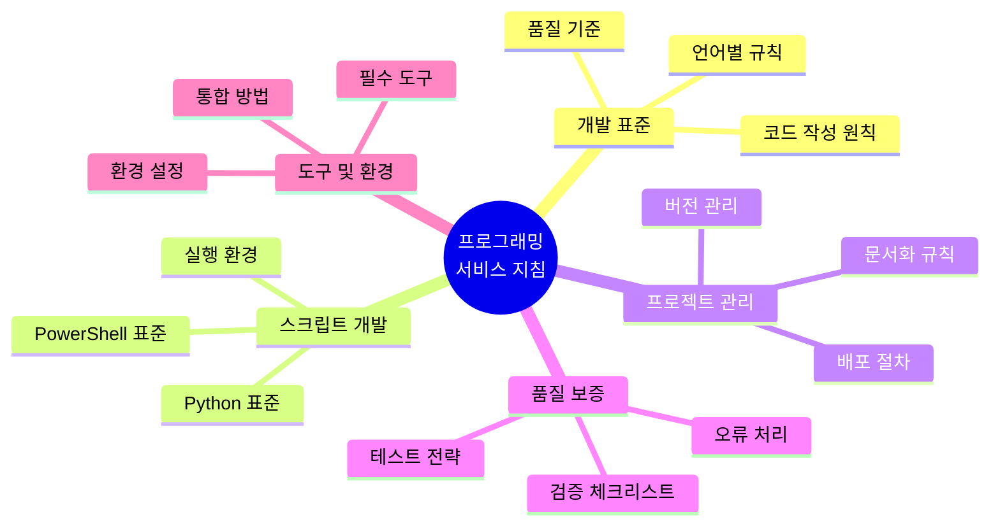
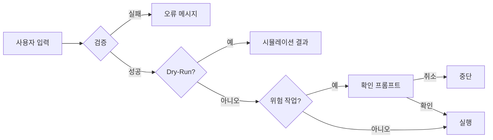
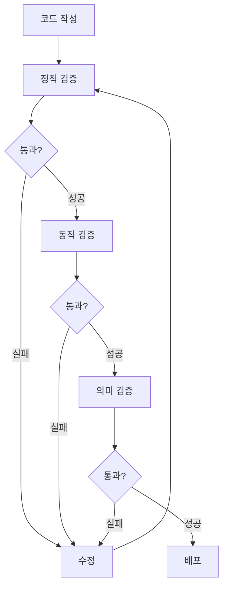
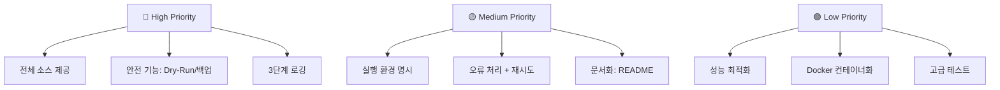

대화 이력과 기존 지침을 분석하여 프로그래밍 서비스 지침을 생성하겠습니다.프로그램 프로젝트의 대화 이력과 기존 지침을 분석하여 최종 프로그래밍 서비스 지침을 생성하겠습니다.

---

# 🎯 프로그래밍 서비스 지침 v2.0

## 📋 지침 개요

본 지침은 **Windows 환경 중심의 자동화·미디어 처리·ERP 개발·문서화 작업**을 위한 완전한 실행 가능 표준입니다. PowerShell/Python 기반 스크립트 개발, 파일 동기화, 중복 검출, API 통합, 프로젝트 문서 관리 등 실무 시나리오에 즉시 적용 가능한 구체적 원칙과 검증 체크리스트를 제공합니다.

**[확인됨]** 기존 프로젝트 지침 v1.0의 핵심 요소(왕복 최소화, GUI 우선, 전체 소스 제공) 유지  
**적용 범위**: EMAX ERP 개발, 자동화 스크립트, 미디어 처리, API 통합, 개발 환경 관리

---

## 🗺️ 전체 지침 구조



---

## 📐 A. 코드 작성 핵심 원칙

### 목적
모든 코드가 **안전성·실행가능성·유지보수성**을 동시에 충족하도록 기본 규칙을 설정합니다.

### 핵심 원칙

#### 1. 전체 소스 제공 원칙 (최우선)
```
✅ 항상 전체 소스 코드를 완전한 형태로 제공
❌ 부분 소스·스니펫·"나머지는 동일" 표현 금지
```

**불가피한 부분 소스 제공 시 필수 머리말**:
```markdown
⚠️ 부분 소스
- 대상 파일: <상대/절대 경로>
- 줄 범위: <시작 줄>~<끝 줄>
- 변경 방식: [추가|수정|삭제] - <1줄 요약>
```

#### 2. 실행 환경 명시
**모든 스크립트/코드 제공 시 필수 포함**:
- 언어/런타임 버전 (예: Python 3.13+, PowerShell 7.4+)
- 의존성 목록 (패키지/모듈)
- OS 요구사항 (Windows 11, Ubuntu 24, macOS Sonoma 등)
- 실행 커맨드 라인 (정확한 파라미터 포함)

**실행 예시 필수**:
```powershell
# 예시 1: 정상 실행
pwsh -NoProfile -ExecutionPolicy Bypass -File .\script.ps1 -SourcePath "C:\Source" -TargetPath "C:\Target"
예상 출력: [성공] 파일 10개 동기화 완료

# 예시 2: 오류 케이스
pwsh -NoProfile -ExecutionPolicy Bypass -File .\script.ps1 -SourcePath "X:\Invalid"
예상 오류: [오류] 경로 'X:\Invalid'를 찾을 수 없습니다 (코드: 2)
```

#### 3. 안전 우선 설계


**필수 안전 기능**:
- [ ] Dry-Run/시뮬레이션 모드 (삭제·덮어쓰기 작업 필수)
- [ ] 백업 생성 (파일 변경 전 자동 백업)
- [ ] 확인 프롬프트 (위험 작업 시 명시적 확인)
- [ ] Undo/Rollback 메커니즘 (메타데이터 기반 복구)
- [ ] 입력 검증 (경로·타입·범위 사전 검증)

#### 4. 3단계 로깅 시스템
| 레벨 | 색상 | 용도 | 예시 |
|------|------|------|------|
| 🟢 성공 | Green | 정상 완료 작업 | `[성공] 파일 10개 동기화 완료` |
| 🟡 경고 | Yellow | 비치명적 문제 | `[경고] 3개 파일 권한 부족으로 건너뜀` |
| 🔴 오류 | Red | 실패·예외 | `[오류] FFmpeg 실행 실패 (코드: 1)` |

**로그 이중 출력**:
- 콘솔: 색상 코딩 + 진행률 표시
- 파일: 타임스탬프 + 상세 컨텍스트 + JSON 구조화 (선택)

#### 5. 견고한 오류 처리
```python
# ✅ 권장 패턴
def process_file(path: str) -> bool:
    """파일 처리 (재시도 로직 포함)"""
    max_retries = 3
    for attempt in range(max_retries):
        try:
            # 작업 수행
            return True
        except FileNotFoundError as e:
            logger.error(f"[오류] 파일 없음: {path}")
            return False  # 재시도 불가능한 오류
        except PermissionError as e:
            if attempt < max_retries - 1:
                logger.warning(f"[경고] 권한 오류, {attempt+1}/{max_retries} 재시도 중...")
                time.sleep(2 ** attempt)  # 지수 백오프
            else:
                logger.error(f"[오류] 권한 오류 (최대 재시도 초과)")
                return False
        except Exception as e:
            logger.error(f"[오류] 예상치 못한 오류: {e}")
            return False
```

**오류 처리 체크리스트**:
- [ ] Try-Catch/Except 블록으로 예외 포착
- [ ] 재시도 가능 오류는 지수 백오프로 재시도 (최대 3회)
- [ ] 치명적 오류는 즉시 중단 + 상세 로그
- [ ] 사용자에게 명확한 오류 메시지 + 해결 방법 제시

---

## 🔧 B. PowerShell 스크립트 표준

### 목적
Windows 환경에서 안정적이고 재사용 가능한 PowerShell 스크립트를 작성합니다.

### 핵심 원칙

#### 1. 스크립트 구조 템플릿
```powershell
<#
.SYNOPSIS
    스크립트의 한 줄 요약
.DESCRIPTION
    상세 설명 (목적, 주요 기능)
.PARAMETER SourcePath
    소스 경로 (필수)
.EXAMPLE
    .\script.ps1 -SourcePath "C:\Source" -TargetPath "C:\Target"
.NOTES
    작성자: 이름
    버전: 1.0.0
    최종 수정: 2025-10-15
#>

[CmdletBinding()]
param(
    [Parameter(Mandatory=$true)]
    [ValidateScript({Test-Path $_ -PathType Container})]
    [string]$SourcePath,
    
    [Parameter(Mandatory=$true)]
    [string]$TargetPath,
    
    [Parameter()]
    [switch]$DryRun
)

# === 설정 ===
$ErrorActionPreference = 'Stop'
$ProgressPreference = 'Continue'

# === 헬퍼 함수 ===
function Write-ColorLog {
    param([string]$Message, [string]$Level = 'Info')
    $colors = @{
        'Success' = 'Green'
        'Warning' = 'Yellow'
        'Error' = 'Red'
        'Info' = 'Cyan'
    }
    Write-Host "[$Level] $Message" -ForegroundColor $colors[$Level]
}

# === 메인 로직 ===
try {
    Write-ColorLog "스크립트 시작" -Level 'Info'
    
    # 작업 수행
    
    Write-ColorLog "완료" -Level 'Success'
} catch {
    Write-ColorLog "실패: $_" -Level 'Error'
    exit 1
}
```

#### 2. 배열 파라미터 처리 (중요)
```powershell
# ❌ 잘못된 방법 (파싱 오류 발생)
pwsh -File script.ps1 -Exclude "*.tmp","*.log"

# ✅ 올바른 방법
pwsh -Command "& '.\script.ps1' -Exclude @('*.tmp','*.log')"

# 또는 스크립트 내부에서 쉼표 분리 문자열로 받기
param([string[]]$Exclude = @())
```

#### 3. 외부 프로세스 실행 안전 패턴
```powershell
function Invoke-ExternalProcess {
    param(
        [string]$FilePath,
        [string[]]$ArgumentList
    )
    
    $process = Start-Process -FilePath $FilePath `
                            -ArgumentList $ArgumentList `
                            -NoNewWindow `
                            -Wait `
                            -PassThru `
                            -RedirectStandardOutput "stdout.txt" `
                            -RedirectStandardError "stderr.txt"
    
    if ($process.ExitCode -ne 0) {
        $stderr = Get-Content "stderr.txt" -Raw
        throw "[오류] $FilePath 실행 실패 (코드: $($process.ExitCode))`n$stderr"
    }
    
    return Get-Content "stdout.txt" -Raw
}
```

#### 4. 파일 작업 원자성 보장
```powershell
# 임시 파일 → 검증 → 원자적 이동
$tempFile = "$TargetPath.tmp"
Copy-Item -Path $SourcePath -Destination $tempFile -Force

# 검증
if ((Get-Item $tempFile).Length -eq 0) {
    Remove-Item $tempFile
    throw "복사 실패: 파일 크기 0"
}

# 원자적 이동 (기존 파일 백업)
if (Test-Path $TargetPath) {
    $backupPath = "$TargetPath.backup_$(Get-Date -Format 'yyyyMMdd_HHmmss')"
    Move-Item -Path $TargetPath -Destination $backupPath
}
Move-Item -Path $tempFile -Destination $TargetPath -Force
```

**실행 체크리스트**:
- [ ] UTF-8 BOM 없이 저장 (`[System.IO.File]::WriteAllText($path, $content, [System.Text.UTF8Encoding]::new($false))`)
- [ ] 실행 정책 우회: `pwsh -ExecutionPolicy Bypass -File script.ps1`
- [ ] 배열 파라미터는 `-Command` 모드 사용
- [ ] 외부 프로세스는 ExitCode 검증 + 표준 오류 캡처

---

## 🐍 C. Python 스크립트 표준

### 목적
미디어 처리·API 통합·자동화 작업을 위한 Python 코드 작성 표준입니다.

### 핵심 원칙

#### 1. 프로젝트 구조
```
project_root/
├── main.py              # 진입점 (CLI)
├── config.py            # 설정 관리
├── requirements.txt     # 의존성
├── README.md           # 사용 문서
├── core/
│   ├── __init__.py
│   ├── scanner.py       # 파일 스캔
│   ├── processor.py     # 처리 로직
│   └── hasher.py        # 해시 계산
├── utils/
│   ├── __init__.py
│   ├── logger.py        # 로깅 유틸
│   └── validator.py     # 검증 함수
└── logs/
    └── app.log
```

#### 2. 타입 힌트 + Docstring 필수
```python
from typing import List, Dict, Optional
from pathlib import Path

def scan_media_files(
    root_dirs: List[Path],
    extensions: List[str],
    recursive: bool = True
) -> Dict[str, List[Path]]:
    """미디어 파일 스캔
    
    Args:
        root_dirs: 스캔할 디렉토리 목록
        extensions: 대상 확장자 (.mp4, .jpg 등)
        recursive: 하위 디렉토리 포함 여부
    
    Returns:
        {확장자: [파일 경로 목록]} 딕셔너리
    
    Raises:
        FileNotFoundError: 디렉토리가 존재하지 않을 때
    """
    results: Dict[str, List[Path]] = {}
    # 구현...
    return results
```

#### 3. Multiprocessing 안전 패턴
```python
from multiprocessing import Pool, cpu_count
from functools import partial

# ✅ 모듈 레벨 함수 (pickle 가능)
def process_video_frame_hash(video_path: str, num_samples: int = 5) -> str:
    """비디오 프레임 해시 계산 (picklable)"""
    # FFmpeg 처리...
    return hash_value

def main():
    videos = [...]
    
    # 부분 적용으로 추가 인자 전달
    process_func = partial(process_video_frame_hash, num_samples=5)
    
    with Pool(cpu_count()) as pool:
        hashes = pool.map(process_func, videos)
```

**❌ 피해야 할 패턴**:
- 클래스 메서드 내부의 중첩 함수 (pickle 불가)
- Lambda 함수 전달 (multiprocessing과 호환 불가)

#### 4. FFmpeg/FFprobe 통합
```python
import subprocess
from pathlib import Path

def get_video_duration(video_path: Path) -> float:
    """FFprobe로 비디오 길이 추출 (오류 억제)"""
    cmd = [
        'ffprobe',
        '-v', 'error',  # 경고 메시지 숨김
        '-show_entries', 'format=duration',
        '-of', 'default=noprint_wrappers=1:nokey=1',
        str(video_path)
    ]
    
    result = subprocess.run(
        cmd,
        capture_output=True,
        text=True,
        encoding='utf-8'
    )
    
    if result.returncode != 0:
        raise RuntimeError(f"FFprobe 실패: {result.stderr}")
    
    return float(result.stdout.strip())
```

**FFmpeg 로그 억제**:
```python
# 비디오 처리 시 경고 제거
ffmpeg_cmd = ['ffmpeg', '-v', 'error', '-i', input_path, ...]
```

#### 5. 캐싱 시스템 (대용량 처리 최적화)
```python
import json
from pathlib import Path
from typing import Optional

class HashCache:
    """파일 해시 캐시 (재계산 방지)"""
    
    def __init__(self, cache_file: Path):
        self.cache_file = cache_file
        self.cache = self._load()
    
    def _load(self) -> dict:
        if self.cache_file.exists():
            with open(self.cache_file, 'r', encoding='utf-8') as f:
                return json.load(f)
        return {}
    
    def get(self, file_path: Path) -> Optional[str]:
        """캐시에서 해시 조회 (파일 수정 시간 검증)"""
        key = str(file_path)
        if key in self.cache:
            cached_mtime, cached_hash = self.cache[key]
            if file_path.stat().st_mtime == cached_mtime:
                return cached_hash
        return None
    
    def set(self, file_path: Path, hash_value: str):
        """캐시에 해시 저장"""
        key = str(file_path)
        self.cache[key] = (file_path.stat().st_mtime, hash_value)
    
    def save(self):
        """캐시 파일에 저장"""
        with open(self.cache_file, 'w', encoding='utf-8') as f:
            json.dump(self.cache, f, indent=2)
```

**실행 체크리스트**:
- [ ] Python 3.13+ 사용 (타입 힌트 완전 지원)
- [ ] `requirements.txt` 생성: `pip freeze > requirements.txt`
- [ ] 가상 환경 사용: `python -m venv venv`
- [ ] UTF-8 인코딩 명시 (`encoding='utf-8'`)
- [ ] Multiprocessing 시 모듈 레벨 함수 사용

---

## 📦 D. 외부 도구 통합 패턴

### 목적
gallery-dl, FFmpeg, Google API 등 외부 도구를 안정적으로 통합합니다.

### 핵심 원칙

#### 1. gallery-dl (Twitter/X 미디어 다운로드)
```python
import subprocess
import time

def download_twitter_media(url: str, output_dir: str, rate_limit: int = 2):
    """gallery-dl로 Twitter 미디어 다운로드 (레이트 리밋 포함)"""
    cmd = [
        'gallery-dl',
        '--cookies-from-browser', 'chrome',  # 인증 쿠키
        '--write-metadata',                  # JSON 메타데이터 저장
        '--download-archive', 'archive.txt', # 중복 방지
        '-d', output_dir,
        url
    ]
    
    for attempt in range(3):
        try:
            result = subprocess.run(cmd, capture_output=True, text=True, timeout=300)
            
            if result.returncode == 0:
                time.sleep(rate_limit)  # 레이트 리밋
                return True
            elif 'rate limit' in result.stderr.lower():
                wait_time = 60 * (2 ** attempt)
                print(f"[경고] 레이트 리밋 초과, {wait_time}초 대기...")
                time.sleep(wait_time)
            else:
                raise RuntimeError(result.stderr)
        except subprocess.TimeoutExpired:
            print(f"[경고] 타임아웃, {attempt+1}/3 재시도...")
    
    return False
```

#### 2. Google API 통합 (Calendar/Gmail)
```python
from google.oauth2.credentials import Credentials
from google_auth_oauthlib.flow import InstalledAppFlow
from google.auth.transport.requests import Request
from googleapiclient.discovery import build
import os.path

SCOPES = ['https://www.googleapis.com/auth/calendar.readonly',
          'https://www.googleapis.com/auth/gmail.send']

def get_google_credentials():
    """OAuth 2.0 인증 (토큰 캐싱)"""
    creds = None
    if os.path.exists('token.json'):
        creds = Credentials.from_authorized_user_file('token.json', SCOPES)
    
    if not creds or not creds.valid:
        if creds and creds.expired and creds.refresh_token:
            creds.refresh(Request())
        else:
            flow = InstalledAppFlow.from_client_secrets_file('credentials.json', SCOPES)
            creds = flow.run_local_server(port=0)
        
        with open('token.json', 'w') as token:
            token.write(creds.to_json())
    
    return creds
```

#### 3. 오류 처리 및 재시도 전략
| 오류 유형 | 재시도 | 대기 시간 | 예시 |
|-----------|--------|----------|------|
| 네트워크 일시 장애 | 3회 | 지수 백오프 (2^n초) | `ConnectionError` |
| 레이트 리밋 | 5회 | 60초 × 재시도 횟수 | `429 Too Many Requests` |
| 인증 만료 | 1회 | 즉시 재인증 | `401 Unauthorized` |
| 파일 없음 | 재시도 없음 | - | `FileNotFoundError` |

**통합 체크리스트**:
- [ ] 외부 명령 실행 시 `timeout` 설정 (무한 대기 방지)
- [ ] 표준 오류 캡처 + 로깅
- [ ] 레이트 리밋 준수 (API 문서 확인)
- [ ] 인증 토큰 캐싱 (재인증 최소화)
- [ ] 네트워크 오류 재시도 (최대 3~5회)

---

## 🗂️ E. 프로젝트 문서화 표준

### 목적
프로젝트 가이드라인을 체계적으로 관리하고 검색 가능하게 만듭니다.

### 핵심 원칙

#### 1. README 필수 구조
```markdown
# 프로젝트명

## 개요
- **목적**: 한 줄 요약
- **주요 기능**: 3~5개 항목
- **기술 스택**: Python 3.13, PowerShell 7.4, FFmpeg 6.0

## 설치
\`\`\`bash
# 의존성 설치
pip install -r requirements.txt
\`\`\`

## 사용법
\`\`\`bash
# 기본 실행
python main.py --source "C:\Source" --target "C:\Target"

# 드라이런 모드
python main.py --source "C:\Source" --target "C:\Target" --dry-run
\`\`\`

## 설정
- `config.json`: 임계값, 제외 패턴 설정
- 환경 변수: `API_KEY`, `LOG_LEVEL`

## 문제 해결
| 문제 | 원인 | 해결 |
|------|------|------|
| `ModuleNotFoundError` | 의존성 미설치 | `pip install -r requirements.txt` |
| `Permission denied` | 관리자 권한 필요 | 관리자 모드로 실행 |

## 라이선스
MIT License
```

#### 2. 가이드라인 템플릿 (Claude AI 프로젝트용)
```markdown
# [프로젝트명] 개발 가이드라인

## A. 프로젝트 개요
- **도메인**: 미디어 처리 / ERP 개발 / 자동화
- **핵심 기술**: PowerShell, Python, FFmpeg
- **주요 산출물**: 스크립트, 문서, API 통합

## B. 코드 작성 규칙
- 전체 소스 제공 원칙
- 3단계 로깅 (성공/경고/오류)
- Dry-Run 모드 필수

## C. 파일 구조
\`\`\`
project/
├── scripts/      # PowerShell/Python 스크립트
├── config/       # 설정 파일
├── docs/         # 문서
└── logs/         # 로그 파일
\`\`\`

## D. 테스트 시나리오
1. 정상 케이스: ...
2. 오류 케이스: ...
3. 경계 케이스: ...

## E. 배포 절차
1. 테스트 실행
2. 버전 태그 생성
3. 문서 업데이트
4. 배포

## F. 버전 이력
- v1.0.0 (2025-10-15): 초기 릴리스
- v1.1.0 (2025-10-20): 기능 추가
```

#### 3. 버전 관리 규칙
```
Major.Minor.Patch (예: 2.1.3)

Major: 하위 호환 불가능한 변경
Minor: 하위 호환 가능한 기능 추가
Patch: 버그 수정
```

**문서화 체크리스트**:
- [ ] README.md 필수 섹션 완료
- [ ] 실행 예시 2개 이상 (정상 + 오류)
- [ ] 문제 해결 가이드 포함
- [ ] 설정 파일 설명
- [ ] 버전 이력 작성

---

## 🧪 F. 테스트 및 검증 전략

### 목적
코드가 예상대로 동작하는지 다각도로 검증합니다.

### 핵심 원칙

#### 1. 3단계 검증 루프


#### 2. 테스트 시나리오 템플릿
```python
# test_media_scanner.py
import pytest
from pathlib import Path
from core.scanner import scan_media_files

def test_scan_normal_case():
    """정상 케이스: 기본 디렉토리 스캔"""
    result = scan_media_files([Path('test_data')], ['.mp4', '.jpg'])
    assert len(result) > 0
    assert '.mp4' in result
    assert '.jpg' in result

def test_scan_empty_directory():
    """경계 케이스: 빈 디렉토리"""
    result = scan_media_files([Path('empty_dir')], ['.mp4'])
    assert result == {'.mp4': []}

def test_scan_invalid_path():
    """오류 케이스: 존재하지 않는 경로"""
    with pytest.raises(FileNotFoundError):
        scan_media_files([Path('invalid_path')], ['.mp4'])

def test_scan_large_directory(benchmark):
    """성능 테스트: 대용량 디렉토리 (1000개 파일)"""
    result = benchmark(scan_media_files, [Path('large_dir')], ['.mp4'])
    assert benchmark.stats['mean'] < 5.0  # 5초 이내
```

#### 3. 검증 체크리스트
**기능 검증**:
- [ ] 정상 케이스 2개 이상 테스트
- [ ] 경계 케이스 (빈 입력, 최대값 등) 테스트
- [ ] 오류 케이스 (잘못된 입력) 테스트

**성능 검증**:
- [ ] 대용량 데이터 처리 시간 측정
- [ ] 메모리 사용량 모니터링
- [ ] 병목 구간 식별 (프로파일링)

**보안 검증**:
- [ ] SQL Injection 방어 (파라미터화된 쿼리)
- [ ] 경로 순회 공격 방어 (경로 정규화)
- [ ] 입력 검증 (타입·범위·형식)

---

## 🚀 G. 배포 및 실행 가이드

### 목적
스크립트를 실제 환경에 안전하게 배포하고 자동화합니다.

### 핵심 원칙

#### 1. Windows 배포 체크리스트
```powershell
# 1. 실행 정책 설정
Set-ExecutionPolicy -ExecutionPolicy RemoteSigned -Scope CurrentUser

# 2. 스크립트 언블록 (다운로드 파일)
Unblock-File -Path "C:\Scripts\*.ps1"

# 3. 의존성 확인
Get-Module -ListAvailable | Where-Object {$_.Name -eq 'PSReadLine'}

# 4. 테스트 실행
pwsh -ExecutionPolicy Bypass -File "C:\Scripts\test.ps1" -DryRun

# 5. 배포
Copy-Item -Path "C:\Dev\Scripts\*" -Destination "C:\Scripts\" -Recurse
```

#### 2. Windows 작업 스케줄러 자동화
```powershell
# 매일 오전 9시 실행 작업 생성
$action = New-ScheduledTaskAction -Execute 'pwsh.exe' `
    -Argument '-NoProfile -ExecutionPolicy Bypass -File "C:\Scripts\sync.ps1"'

$trigger = New-ScheduledTaskTrigger -Daily -At 9am

$settings = New-ScheduledTaskSettingsSet -StartWhenAvailable -RunOnlyIfNetworkAvailable

Register-ScheduledTask -TaskName "DailySync" `
    -Action $action `
    -Trigger $trigger `
    -Settings $settings `
    -Description "폴더 동기화 작업"
```

#### 3. Python 배포 (가상 환경)
```bash
# 1. 가상 환경 생성
python -m venv venv

# 2. 활성화
# Windows
.\venv\Scripts\activate
# Linux/macOS
source venv/bin/activate

# 3. 의존성 설치
pip install -r requirements.txt

# 4. 실행
python main.py --config config.json
```

#### 4. Docker 컨테이너화 (고급)
```dockerfile
# Dockerfile
FROM python:3.13-slim

WORKDIR /app

# FFmpeg 설치
RUN apt-get update && apt-get install -y ffmpeg && rm -rf /var/lib/apt/lists/*

COPY requirements.txt .
RUN pip install --no-cache-dir -r requirements.txt

COPY . .

CMD ["python", "main.py"]
```

**실행 명령**:
```bash
docker build -t media-processor .
docker run -v C:\Media:/data media-processor --input /data/input --output /data/output
```

**배포 체크리스트**:
- [ ] 실행 정책 설정 (PowerShell)
- [ ] 의존성 확인 (모듈/패키지)
- [ ] Dry-Run 모드로 사전 테스트
- [ ] 로그 디렉토리 생성
- [ ] 작업 스케줄러 등록 (자동화 시)

---

## 🛠️ H. 개발 도구 및 환경

### 목적
효율적인 개발을 위한 필수 도구와 설정을 정리합니다.

### 핵심 도구

#### 1. 필수 개발 도구
| 도구 | 용도 | 버전 | 설치 명령 |
|------|------|------|----------|
| **VSCode** | 코드 편집기 | 최신 | [다운로드](https://code.visualstudio.com) |
| **PowerShell 7+** | 스크립트 실행 | 7.4+ | `winget install Microsoft.PowerShell` |
| **Python** | 스크립트 언어 | 3.13+ | `winget install Python.Python.3.13` |
| **FFmpeg** | 미디어 처리 | 6.0+ | `winget install Gyan.FFmpeg` |
| **Git** | 버전 관리 | 최신 | `winget install Git.Git` |

#### 2. VSCode 필수 확장
```json
{
  "recommendations": [
    "ms-python.python",              // Python 지원
    "ms-vscode.powershell",          // PowerShell 지원
    "streetsidesoftware.code-spell-checker", // 맞춤법 검사
    "ms-azuretools.vscode-docker",   // Docker 지원
    "donjayamanne.githistory"        // Git 이력
  ]
}
```

#### 3. VSCode 설정 (`settings.json`)
```json
{
  "python.defaultInterpreterPath": "${workspaceFolder}\\venv\\Scripts\\python.exe",
  "python.linting.enabled": true,
  "python.linting.pylintEnabled": true,
  "python.formatting.provider": "black",
  "powershell.codeFormatting.preset": "OTBS",
  "files.encoding": "utf8",
  "files.eol": "\n",
  "editor.rulers": [80, 120],
  "editor.renderWhitespace": "boundary"
}
```

#### 4. Total Commander 통합
**사용자 정의 명령**:
```
[프로그램 프로젝트 검색]
명령: pwsh.exe
파라미터: -NoProfile -File "C:\Scripts\search_projects.ps1" -Query "%P%N"
아이콘: C:\Scripts\icon.ico
```

**도구 설정 체크리스트**:
- [ ] VSCode 확장 설치
- [ ] Python 가상 환경 설정
- [ ] PowerShell 모듈 설치 (`PSReadLine`, `posh-git`)
- [ ] Git 설정 (`git config --global user.name/email`)
- [ ] FFmpeg 경로 확인 (`ffmpeg -version`)

---

## 📊 I. 품질 기준 및 자체 검증

### 목적
모든 산출물이 일정 수준 이상의 품질을 유지하도록 합니다.

### 품질 평가 매트릭스

| 영역 | 평가 항목 | 배점 | 기준 |
|------|----------|------|------|
| **코드 품질** | 전체 소스 제공 | 15 | 완전한 실행 가능 코드 |
| | 타입 힌트/주석 | 10 | Python 타입 힌트 + Docstring |
| | 오류 처리 | 10 | Try-Catch + 재시도 로직 |
| **안전성** | Dry-Run 모드 | 10 | 시뮬레이션 기능 존재 |
| | 백업 메커니즘 | 10 | 변경 전 자동 백업 |
| | 입력 검증 | 5 | 경로/타입/범위 검증 |
| **실행가능성** | 명령 예시 | 10 | 실행 커맨드 2개 이상 |
| | 환경 명시 | 5 | 언어/OS/의존성 기재 |
| | 오류 재현 | 5 | 오류 케이스 + 예상 메시지 |
| **문서화** | README 완성도 | 10 | 필수 섹션 충족 |
| | 문제 해결 가이드 | 5 | 트러블슈팅 표 포함 |
| | 시각적 요소 | 5 | 다이어그램/표 2개 이상 |

**총점: 100점**  
**합격 기준: 80점 이상**

### 최종 체크리스트

#### ✅ 코드 작성
- [ ] 전체 소스 제공 (부분 소스 시 머리말 규약 준수)
- [ ] 실행 환경 명시 (언어/버전/의존성/OS)
- [ ] 실행 커맨드 라인 제공 (정확한 파라미터)
- [ ] 입력 예시 2개 + 예상 출력
- [ ] 오류 케이스 1개 + 예상 메시지

#### ✅ 안전성
- [ ] Dry-Run/시뮬레이션 모드 구현
- [ ] 백업 생성 (파일 변경 전)
- [ ] 확인 프롬프트 (위험 작업 시)
- [ ] Undo/Rollback 메커니즘
- [ ] 입력 검증 (경로·타입·범위)

#### ✅ 오류 처리
- [ ] Try-Catch/Except 블록
- [ ] 재시도 로직 (지수 백오프)
- [ ] 3단계 로깅 (성공/경고/오류)
- [ ] 명확한 오류 메시지 + 해결 방법

#### ✅ 문서화
- [ ] README.md 필수 섹션 완료
- [ ] 실행 예시 2개 이상
- [ ] 문제 해결 가이드
- [ ] 설정 파일 설명
- [ ] 버전 이력

#### ✅ 테스트
- [ ] 정상 케이스 테스트
- [ ] 경계 케이스 테스트
- [ ] 오류 케이스 테스트
- [ ] 성능 벤치마크 (대용량 데이터)

---

## 🔄 J. 변경 관리 및 이력

### 목적
지침 변경 사항을 추적하고 일관성을 유지합니다.

### 변경 기록 형식

```markdown
## [버전] - YYYY-MM-DD

### 추가 (Added)
- 새 기능/섹션 설명

### 변경 (Changed)
- 기존 내용 수정 사항

### 수정 (Fixed)
- 오류/오타 수정

### 제거 (Removed)
- 삭제된 내용
```

### 버전 이력

#### v2.0.0 - 2025-12-10
**추가**:
- PowerShell 배열 파라미터 처리 가이드
- Python Multiprocessing 안전 패턴
- FFmpeg/FFprobe 로그 억제 방법
- 캐싱 시스템 구현 예시
- Docker 컨테이너화 가이드
- 품질 평가 매트릭스 (100점 체계)

**변경**:
- 코드 작성 원칙을 5개 핵심 원칙으로 구조화
- 실행 예시를 필수 요소로 강화 (입력 2개 + 오류 1개)
- 로깅 시스템을 3단계 구조로 명확화

**수정**:
- PowerShell 스크립트 템플릿의 ValidateScript 구문 오류 수정
- Python 타입 힌트 예시의 import 경로 정정

---

## 📖 K. 사용 가이드

### 이 지침의 활용 방법

#### 1단계: 프로젝트 초기화
```bash
# 새 프로젝트 생성
mkdir my_project
cd my_project

# 가상 환경 생성 (Python)
python -m venv venv
.\venv\Scripts\activate

# 초기 파일 생성
New-Item -ItemType File -Path README.md, requirements.txt, config.json
```

#### 2단계: 코드 작성
- **A. 코드 작성 핵심 원칙** 참조
- **B. PowerShell 표준** 또는 **C. Python 표준** 적용
- **D. 외부 도구 통합 패턴** 활용 (필요 시)

#### 3단계: 테스트 및 검증
- **F. 테스트 및 검증 전략** 체크리스트 수행
- **I. 품질 기준** 매트릭스로 자체 평가 (80점 이상 확인)

#### 4단계: 문서화
- **E. 프로젝트 문서화 표준** 템플릿 적용
- README.md 필수 섹션 작성

#### 5단계: 배포
- **G. 배포 및 실행 가이드** 체크리스트 수행
- 작업 스케줄러 등록 (자동화 시)

### 적용 우선순위



---

## 🎯 마지막 점검

### 프로그래밍 서비스 제공 시 최종 검증

모든 스크립트·코드 제공 시 아래 항목을 **반드시** 확인:

1. **전체 소스 제공** 완료 (부분 소스 시 머리말 규약)
2. **실행 환경 명시** (언어/버전/의존성/OS)
3. **실행 커맨드 라인** 제공 (파라미터 포함)
4. **입력 예시 2개** + 예상 출력
5. **오류 케이스 1개** + 예상 메시지
6. **Dry-Run 모드** 구현 (삭제·덮어쓰기 작업)
7. **3단계 로깅** (성공/경고/오류)
8. **Try-Catch 오류 처리** + 재시도 로직
9. **README.md** 필수 섹션 완료
10. **품질 평가** 80점 이상 확인

---

**지침 버전**: v2.0.0  
**최종 수정**: 2025-12-10  
**적용 범위**: EMAX ERP, 자동화 스크립트, 미디어 처리, API 통합  
**우선순위**: 법·보안 → 시스템 지침 → 사용자 요구 → 본 지침